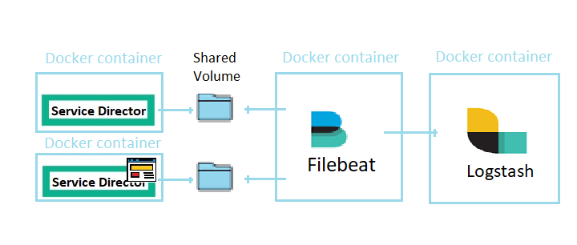
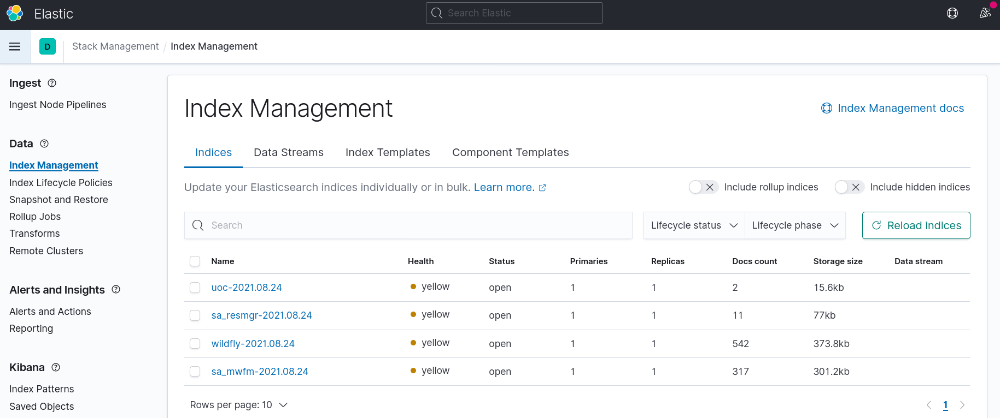
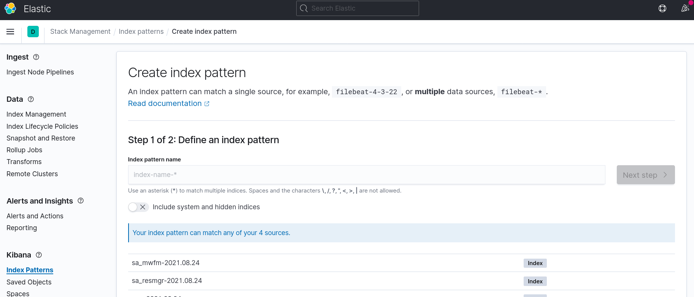
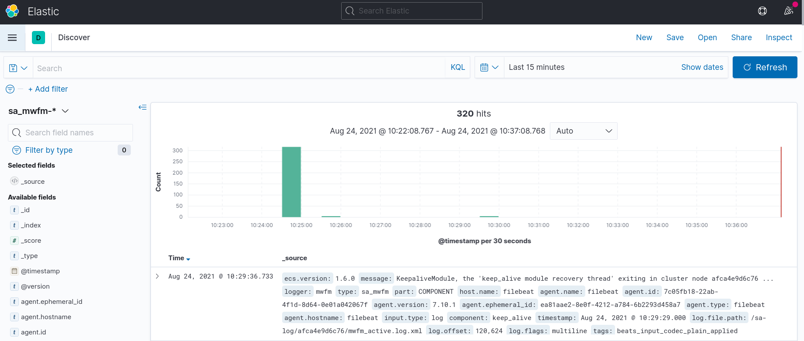

# Service Director ELK Scenario

To ensure Service Director is available, performant and secure at all times, you can rely on the different types of logs generated. This data enables monitoring of SD and the identification and resolution of issues.

Architecture has evolved into containers infrastructure deployed on the cloud, across clouds or in hybrid environments. The volume of logs generated by SD is constantly growing and constitutes a challenge in itself. The ELK Stack integrated with SD fulfills the needs in the log management and analytics for the platform.

The ELK Stack helps by providing us with a powerful platform that collects and processes data from multiple SD logs, stores that data in one centralized data store that can scale as data grows, and that provides a set of tools to analyze the data.

Elasticsearch is the main piece of the ELK stack, it is a modern search and analytics engine that stores data in a way that allows using SQL statements to interact with the data. In the context of data analysis, Elasticsearch is used together with the other components in the ELK Stack, Logstash and Kibana, and plays the role of data indexing and storage.

Kibana is the analysis and visualization tool of the ELK stack, it uses a browser ui that allows to search, inspect and visualize the data stored in Elasticsearch indices. You can review your data more closely or in different ways, using a wide variety of different charts and graphs.

This guide installs SD+ELK demo using basic Docker commands without needing to download or install any further software. This installation lets you quickly evaluate SD+ELK in a machine with Docker on any platform.

The compose file defines a standard Service Director configuration with Filebeat sending log files to an ELK stack: one logstash integrator, one elasticsearch node and a Kibana instance to display the results.

Filebeat is a lightweight component for collecting and forwarding log data. Installed as a container that reads the log folders of the SD container, Filebeat monitors the SD log files or locations that you specify, collects log events, and forwards them to Logstash for indexing and transformation.

The docker-compose.yaml file defines a standard Service Director container for Docker with Filebeat container reading the log files through shared volumes. It also defines a  Service Director UI container for Docker with Filebeat container reading the log files through shared volumes. Filebeat container it is setup to send log information to an ELK stack through Logstash.

For more information about ELK, please consult [ELK](https://www.elastic.co/what-is/elk-stack) page.

**IMPORTANT**:  This configuration profile is not suitable for performance evaluation. It is designed to showcase ELK functionality with low levels of tracing and access logging.

Service Activator requires an external database instance and a CouchDB instance to connect to. For the purpose of this example we are going to use EnterpriseDb Lite v11 which you can pull from EnterpriseDB container repository ([request access here](https://www.enterprisedb.com/repository-access-request)). You can also find an example using an Oracle database in [sd-oracle](../sd-oracle). For production environments you should either use an external, non-containerized database or create an image of your own.

The ELK stack requires a Kafka/Zookeeper cluster, and for that purpose we are using images `kibana/kibana` and `bitnami/zookeeper` which are available on docker.elastic.co.

So, this compose file contains the following services:

- `db`: fulfillment database server
- `sp`: Service Director node
- `ui`: Service Director UI node
- `filebeat`: filebeat service
- `kibana`: kibana node
- `logstash`: logstash service
- `elasticsearch`: elasticsearch node
- `couchdb`: CouchDB database

The following ports are exposed:

- `5601`: Kibana web interface
- `5044`: Logstash data entry port
- `9600`: Logstash web API calls
- `9200`: Elasticsearch web API calls
- `8080`: SD access port

We Write Filebeat own logs only to file to avoid catching them with itself in docker log files. This folder must be created outside the container, on the Docker host. By the default the folder is

     /var/log/filebeat

The example includes filebeat, logstash and elasticsearch configuration files, they are mounted inside the standard images and then a new docker image is created for running the ELK stack. The filebeat config file is configured for accessing some logs from the sd node but some extra logs can be added modifying this config file and the docker-compose.yml file.

Elasticsearch is configured to work as a single-node cluster in this example with the `discovery.type` parameter set to "single-node". For multi-node cluster configuration refer to elasticsearch [documentation](https://www.elastic.co/guide/en/elasticsearch/reference/current/docker.html).

The logs can be seen in Kibana as elasticsearch index but in order to use them in Kibana you have to convert them to Kibana index patterns.

If you want to bring the compose up, you just need to run `docker-compose up -d` from this directory.

To bring the compose down, you just need to run `docker-compose down` from this directory.

###  How to check SD-ELK stack is working and first steps

When the ELK containers are ready, the Kibana UI is exposed on the following url:

        http://localhost:5601/       (Kibana UI)

When the SD containers are ready,  the SD User Interfaces are exposed on the following urls:

        http://localhost:3000/login       (Service Director UI)

        http://localhost:8080/activator/  (Service Director native UI)

Filebeat container collects the following SD log information and send it to logstash container:

 - `SD container`    : JBoss log using the following path - /opt/HP/jboss/standalone/log/
 - `SD container`    : Service Activator losg using the following path - /var/opt/OV/ServiceActivator/log/
 - `SD container`    : SNMP adapter log using the following path - /opt/sd-asr/adapter/log/
 - `SD UI container`: UOC log using the following path - /var/opt//uoc2/logs

Those logs are collected and transformed in logstash, then are sent to elasticsearch and stored with the following index name:

        wildfly-YYYY.MM.dd    (JBoss log)

        sa_mwfm-YYYY.MM.dd    (Service Activator log)

        sa_resmgr-YYYY.MM.dd  (Service Activator log)

        uoc-YYYY.MM.dd        (Unified OSS Console log)

You can check if the SD logs indexes were created and stored in elasticsearch using the Kibana web interface, open the following URL in your browser:

        http://localhost:5601/

Then click the top left main menu icon, select "Stack Management" under the "Management" menu and finally go to the "Data - Index Management" section. Some of the logs mentioned previously should appear.

Select "Kibana - Index Patterns" under the "Kibana" menu, then click on "Create index pattern" and define one log index pattern (e.g "sa_mwfm-*") or just input one of them.

Now your log data will be available under the "Kibana - Discover" menu.

