# Prometheus & Grafana dashboards additional Information

Prometheus is a powerful tool that gathers metrics information from exposed endpoints. In the other hand, Grafana, takes info from data sources in order to build dashboards with the retrieved data. Grafana is able to work with Prometheus as data source.

In order to get the metrics from and endpoint, a couple things must be taken into account:

- Prometheus gets targets from configuration sections addressed as "jobs". Each job needs at least, a specified hostname and endpoint.
- The endpoint must expose prometheus compilant metrics.

Regarding the later, if the service's metrics endpoint is not Prometheus compilant, an "exporter" will be needed. This exporter will run as a sidecar container for the service. There are several types of exporters, i.e: Kafka works with a so called "JMX exporter" that takes the Java Management Extensions metrics format to Prometheus format.

So you will end up having one of the two following data-flow for each service:

- Service with Prometheus compliant endpoint:

  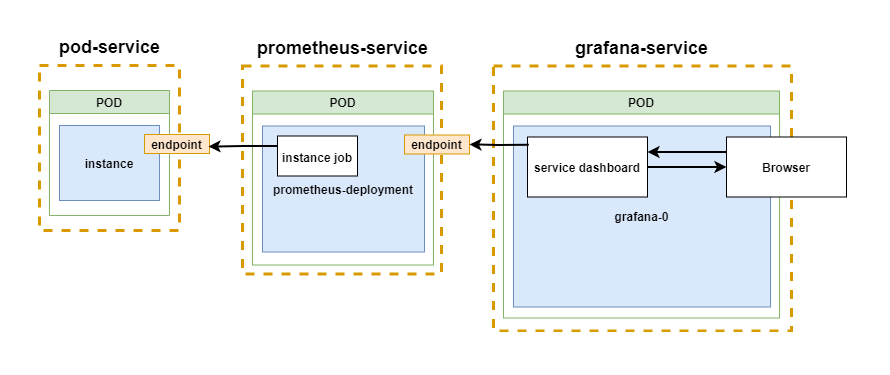

The container exposes it's endpoint to the configured job in the Prometheus deployment and then Grafana retrieves the metrics from the Prometheus service.

- Service without Prometheus compliant endpoint:

  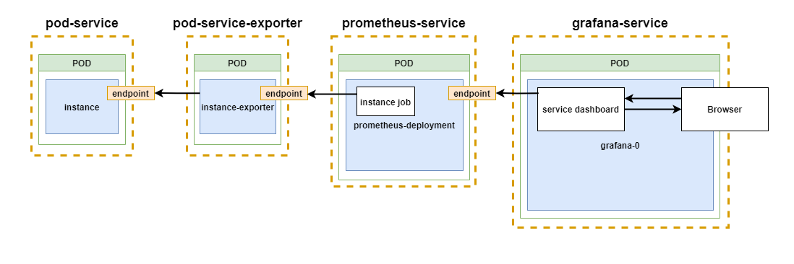

In this case, a sidecar container is needed in the data-flow in order to translate the container's exposed metrics to the configured Prometheus job. Then, as in the previous case, Grafana retrieves data from Prometheus service.

## Instructions

To enable metrics gathering you need to specify `prometheus.enabled=true` or `global.prometheus.enabled=true`. Then you need to enable each available service:

- **SD**: `sdimage.metrics.enabled=true`.
- **Kafka**: `kafka.metrics.kafka.enabled=true,kafka.metrics.jmx.enabled=true`
- **ZooKeeper**: `kafka.zookeeper.metrics.enabled=true`
- **Redis**: `redis.metrics.enabled=true`

This section in Grafana's UI contains the example dashboards included in the deployment.

  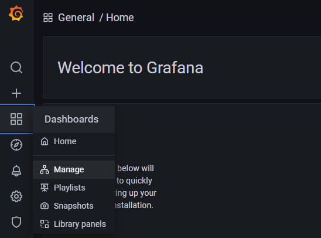

- **`Note`: The sd-ui and the sd-snmp-adapter don't have prometheus compilant endpoints yet, so there is no dashboard implemented for them.**

## Kubernetes SD metrics dashboards

An easy example of the SD metrics dashboards can be enabled and tested if the following parameters are set:

- **SD metrics**: `sdimage.metrics.enabled=true`
- **Prometheus + Grafana**: `prometheus.enabled=true`

If set, this parameters enable Prometheus to retrieve SD metrics and pass them to Grafana to be drawn as graphs in its UI, so an user can have a look at the metrics with ease, with the detail that he/she wants, and starting from an overview to a more detailed metrics info.

The overall view of this **example** is the following:

#### K8s cluster configuration

- CPU cores: 4
- RAM: 12 GB
- SD-SP instances/replicas: 2

#### Scenario

- A DB instance is created for the SD cluster.
- A first SD-SP image instance is created after the DB instance is up.
- A SD-UI image instance is created after the SD-SP image instance is up.
- Some minutes after the first SD-SP image instance is up, a second SD-SP image instance is created.
- Along them, Prometheus and Grafana are also started.

#### Pods

- For that scenario, the involved parameters will deploy, by default, the following pods:

  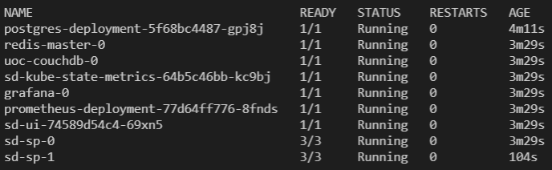

- It can be seen that the deployed pods are:
  - Postgres, Redis and UOC-CouchDB.
  - SD KSM, for retrieving K8s metrics.
  - Grafana + Prometheus.
  - SD-UI.
  - SD-SP (x2), with integrated FluentD metrics collector and envoy proxy for the metrics.

#### URLs

The URLs to access Prometheus and Grafana UIs can be obtained thanks to the info shown just after the deployment, as can be seen in the next image:

  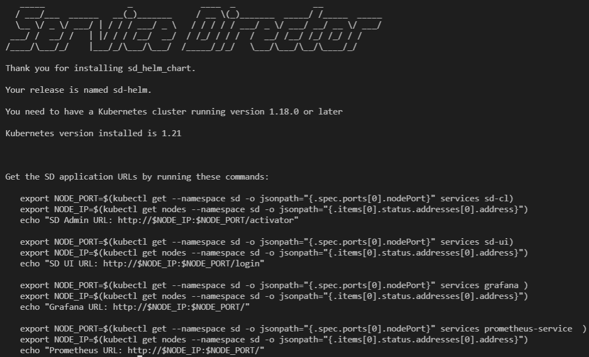

If executed, the provided commands will firstly store the port and the ip of the deployment cluster, and then will show the specific URLs to access Promethus and Grafana.

So, to access them, the commands that are needed are the following:

- **Prometheus**:

````bash
   export NODE_PORT=$(kubectl get --namespace sd -o jsonpath="{.spec.ports[0].nodePort}" services prometheus-service  )
   export NODE_IP=$(kubectl get nodes --namespace sd -o jsonpath="{.items[0].status.addresses[0].address}")
   echo "Prometheus URL: http://$NODE_IP:$NODE_PORT/"
````

- **Grafana**:

````bash
   export NODE_PORT=$(kubectl get --namespace sd -o jsonpath="{.spec.ports[0].nodePort}" services grafana )
   export NODE_IP=$(kubectl get nodes --namespace sd -o jsonpath="{.items[0].status.addresses[0].address}")
   echo "Grafana URL: http://$NODE_IP:$NODE_PORT/"
````

So, the starting point of this **example** will be the Grafana dashboards management section, that will show the following SD available metrics:

  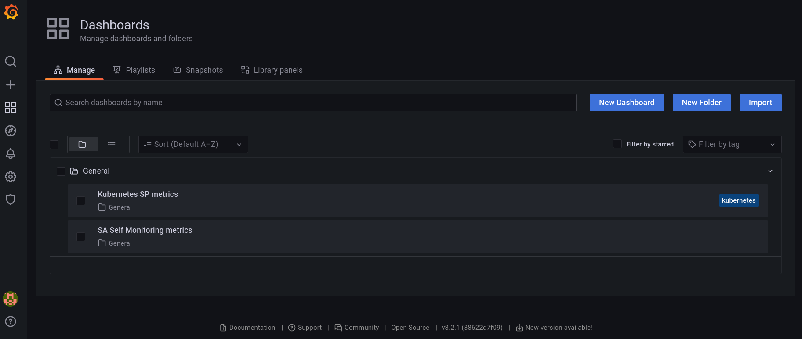

- **Kubernetes SP metrics**: SP metrics that will be available.
- **SA Self monitoring metrics**: SA self-monitoring tool metrics.

### **Kubernetes SP metrics**

Firstly, we can see the next info:

  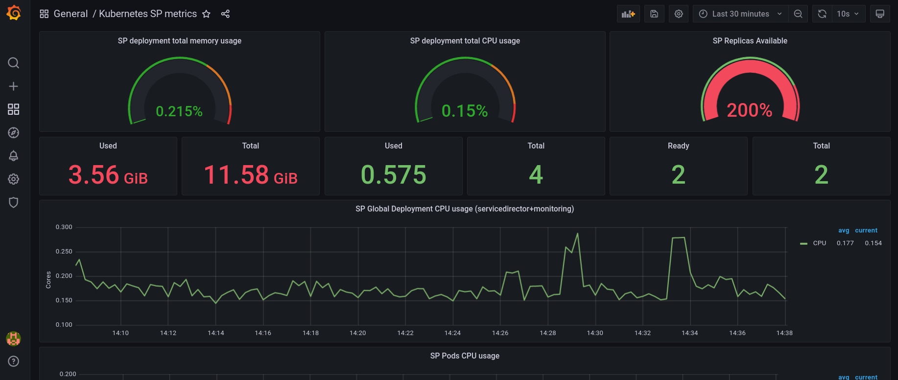

Take note that Grafana UI will expand the available metrics panels to ease their readability by default. If preferred, they can be resized (thanks to the hand icon in the bottom-right corner of each one) to have a customized view of them. This example will make use of this feature, to have a better overview of the panels.

#### **Cluster resources**

The first panels that can be found show the available K8s cluster resources:

  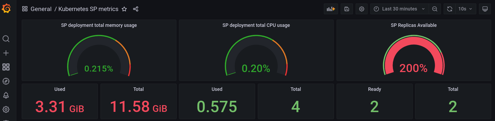

As previously said and can be seen, they are:

- CPU cores: 4
- RAM: 12 GB
- SD-SP instances/replicas: 2

#### **CPU**

Next to the overall cluster view, the CPU usage can be found:

  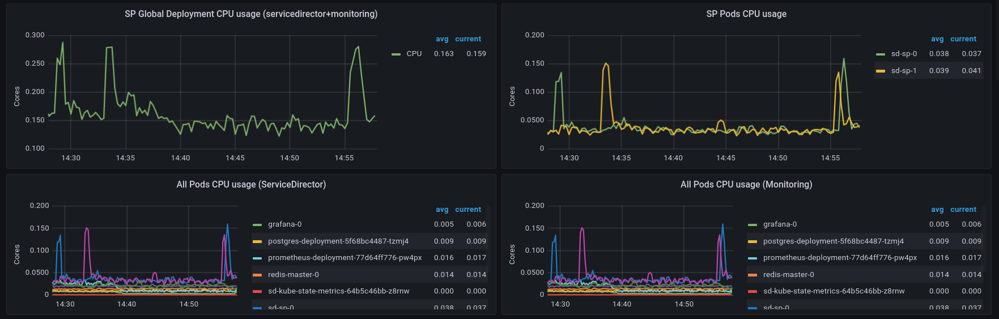

In this panels, it can be seen that the CPU usage was even exceeded during the startup, but shortly after that it was manageable, and the second SD-SP replica was deployed easily. Finally, the CPU proceed to be idle when possible.

- The first CPU burst was generated due to first SD-SP node deployment.
- The second CPU burst was generated due to second SD-SP node deployment.
- A sustained CPU usage remains after second SD-SP node deployment (standby SD cluster).

And for the pods, it can also be seen an easily to understand legend, splitted by colors, pods and by the namespaces used in this example (ServiceDirector and Monitoring).

#### **RAM**

The RAM memory usage can be seen in this panels:

  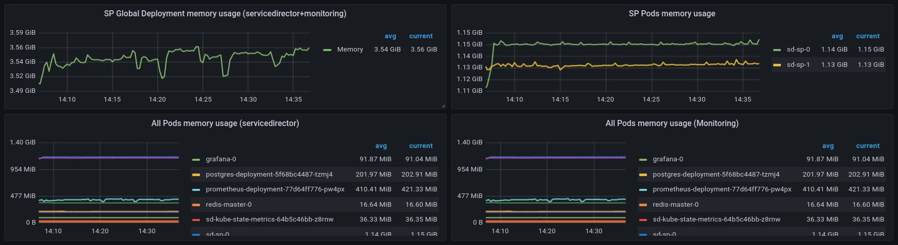

As can be observed in them, a sustained memory usage remains after the two replicas are deployed and no more tasks are needed.

As with the CPU, the memory usage can be seen thanks to an easily to understand legend, splitted by colors, pods and by the namespaces used in this example (ServiceDirector and Monitoring).

#### **Network**

Network traffic during the deployment it's also available in the next panels:

 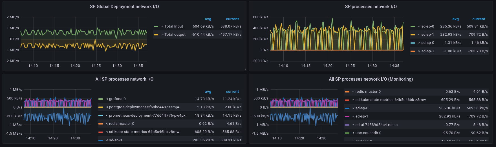

- The green line bursts are inbound traffic on DB instance coming from SD-SP image instances during the initial setup.
- And the yellow line bursts are outbound traffic of SD-SP image instances towards DB during the initial setup.

As with the CPU and memory used, next to the panels  can be seen an easily to understand legend, splitted by colors, pods and by the namespaces used in this example (ServiceDirector and Monitoring).

### **SA Self Monitoring Metrics**

At first, we can see the next info:

  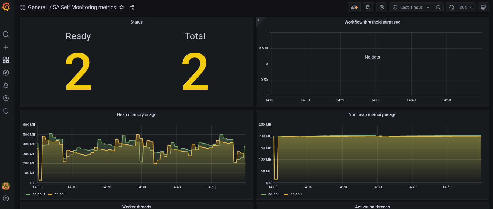

Remember that Grafana UI will expand the available metrics panels to ease their readability by default. If preferred, they can be resized (thanks to the hand icon in the bottom-right corner of each one) to have a customized view of them.

So, thanks to that feature, an overview of all the available panels could be the following:

  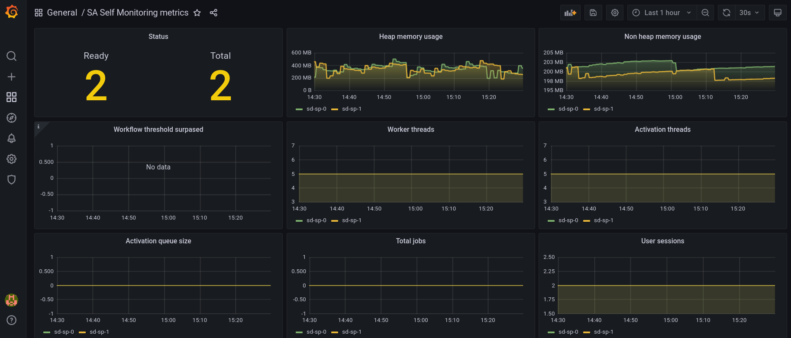

As shown, the available SA metrics info provided by the panels is the following (from left to right and from top to bottom):

- SP nodes available.
- Heap memory usage per SD-SP node.
- Non heap memory usage per SD-SP node.
- Show if the workflow threshold is surpassed and when.
- Worker threads per SD-SP node.
- Activation threads per SD-SP node.
- Left: Activation queue size per SD-SP node.
- Right: Total jobs per SD-SP node.
- user sessions per SD-SP node.

## Third-party container metrics

### Intro

- **`Important`: Please, take into account that third-party items are not part of SD-Cloud product nor supported by HPE.
  Many metrics represented in the example dashboards need a wide knowledge of this services, so please, refeer to the official documentation and support channels of each component if in doubt.
**

SD Helm chart provides a Prometheus/Grafana implementation **only** for the following third-party containers: **Redis, Kafka & ZooKeeper**.

  

### Redis metrics dashboard

Redis example dashboard shows:

  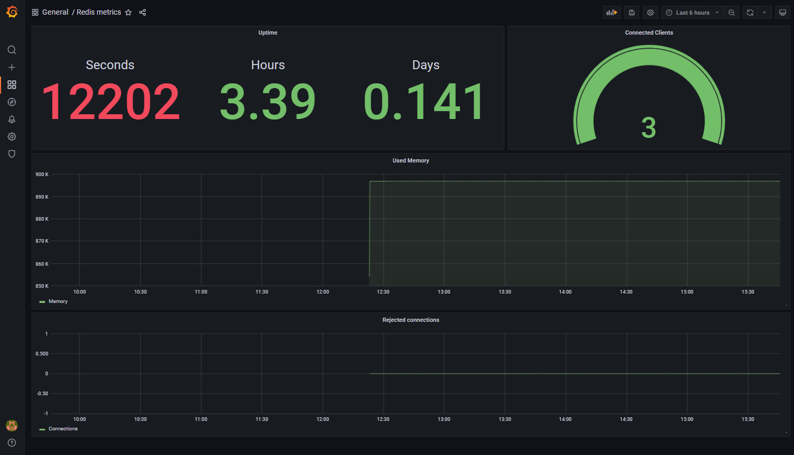

  This dashboard includes service uptime, number of connected clients, used memory and rejected connections.

### Kafka metrics dashboard

Kafka's example dashboard sections include:

- General kafka cluster info

  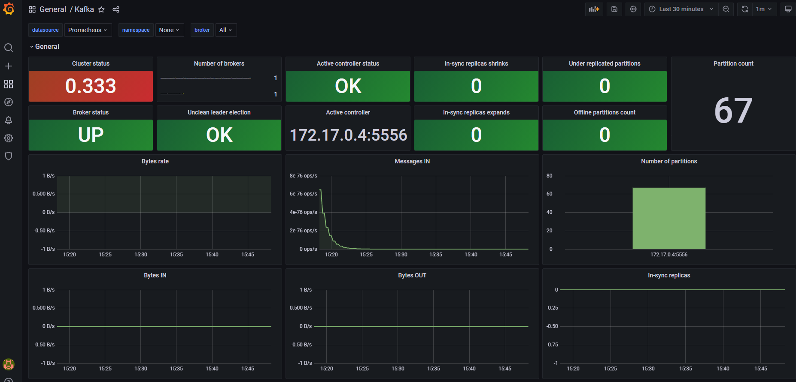

  Where a overview of the cluster, it's controllers and brokers can be retrieved such as number of messages and network metrics.

- JVM metrics

  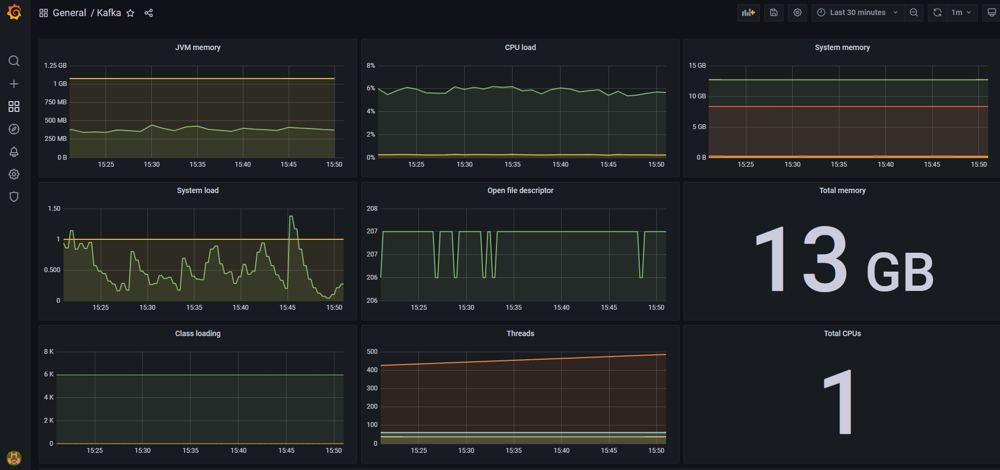

  This section gathers info around Java Virtual Machine status under the total cluster resources view.

- Specific kafka metrics details

  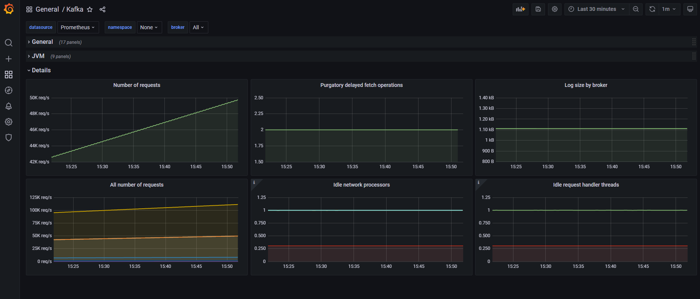

  The details section has more fine grained kafka service related metrics.

### ZooKeeper metrics dashboard

In order to work you must specify the `zookeeper` job in the dashboard toolbar:

  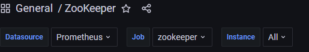

ZooKeeper dashboard has only one **overall** section:

  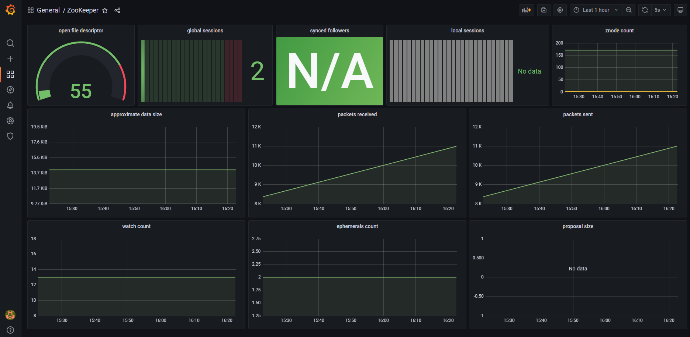

- `Note`: Some panels in the ZooKeeper dashboard might not show information because they require more than one replica of ZooKeeper. This dashboard can be edited and saved in order to remove these non working panels. Affected panels will be:

  - Synced followers
  - Local sessions
  - Proposal size

### Troubleshooting

- `Prometheus jobs`:

In order to get the dashboards working, all the data-flow must be functional. One way to check if it's properly configured is through the Prometheus UI. You can retrieve Prometheus UI endpoint from the SD Helm chart notes, then going throught the navigation bar **Status -> Targets** or directly to **/targets** page and you should see something like this:

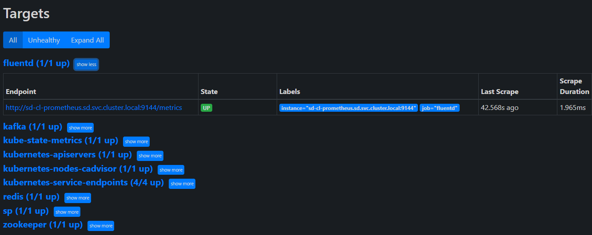

Where the working jobs are shown in blue and non-working in red. If the job is in red or not listed might be due a values misconfiguration.
