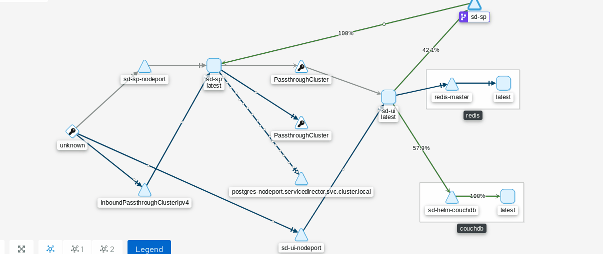
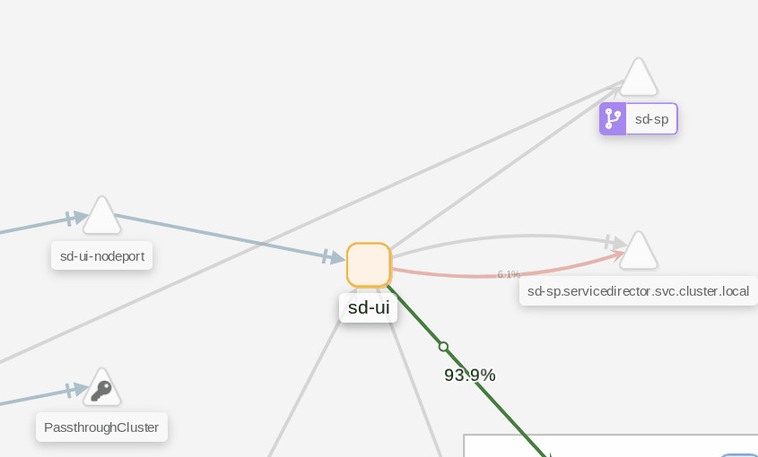
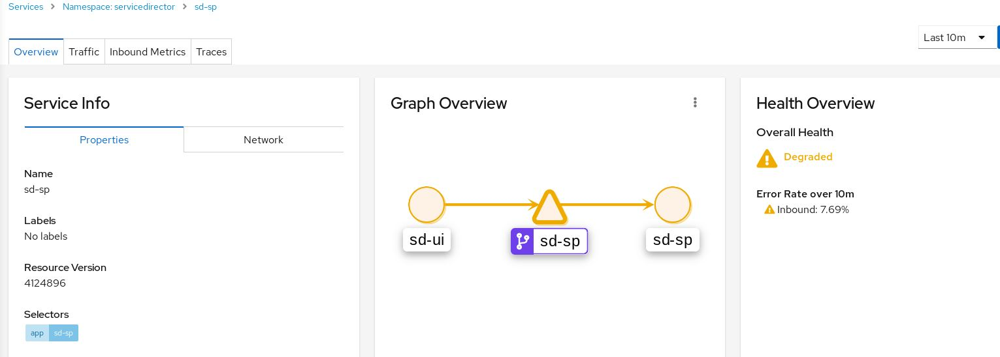
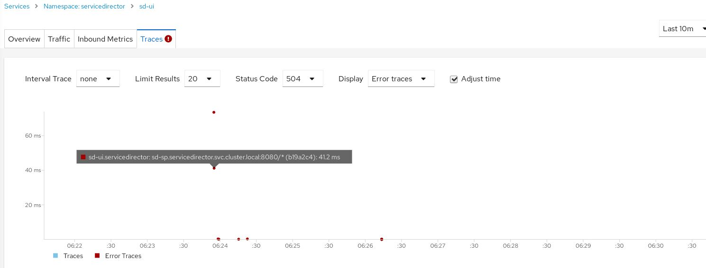
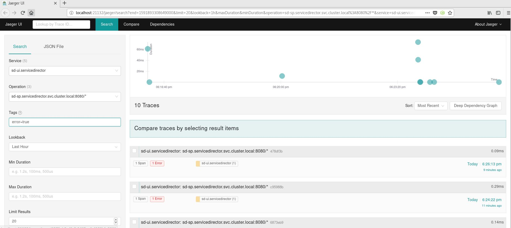
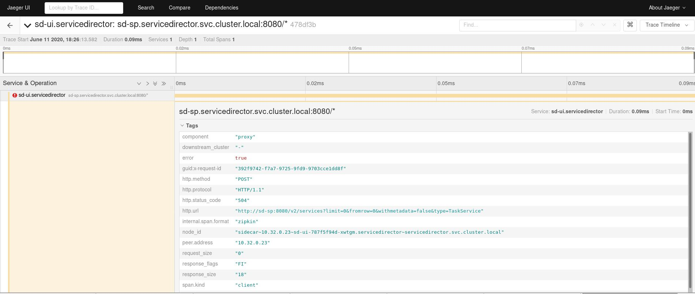
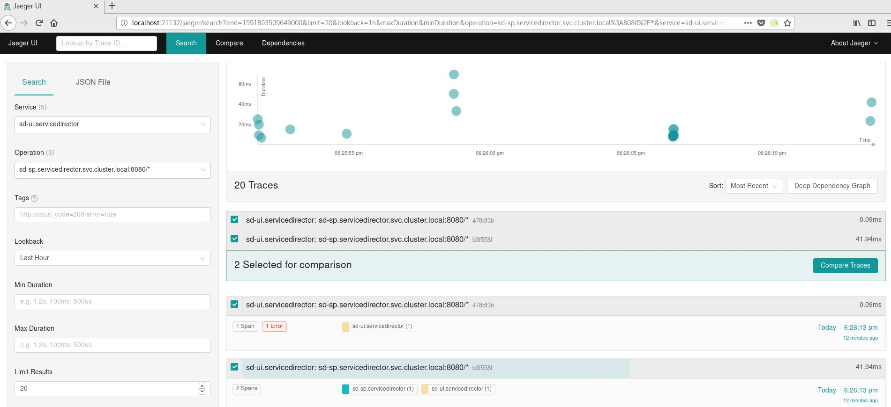
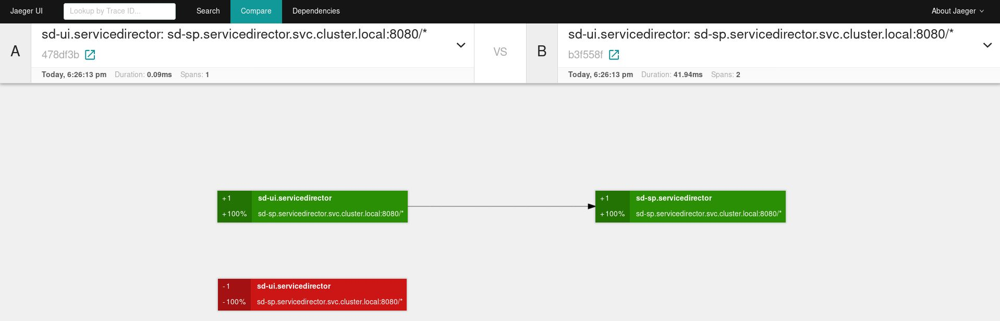

**Table of Contents**

  - [Introduction](#introduction)
  - [Deploy Service Director with Istio](#deploy-service-director-with-istio)
  - [Configure external access to Service Director](#configure-external-access-to-service-director)
  - [Configure Egress for SD database](#configure-egress-for-sd-database)
  - [Display topology deployments with Kiali](#display-topology-deployments-with-kiali)
  - [Check SD health status with Kiali](#check-sd-health-status-with-kiali)
  - [Use Jaeger to find network problems in SD components](#use-jaeger-to-find-network-problems-in-sd-components)  
  - [Secure browser connections](#secure-browser-connections)

## Introduction

A service mesh is a dedicated infrastructure layer between your Kuberntes services that adds additional capabilities like traffic control, load balancing, observability or security, along with others.
This infrastructure layer can register how well or bad different parts of a deployment interact, that helps to optimize communication and avoid downtime in production environments.

Istio is an implementation of a service mesh and provides several of the services mentioned, it deploys several pods in Kubernetes and it does not need external components or configurations. 


## Deploy Service Director with Istio

Kubernetes offer default round-robin load balancing behind its service objects,  Istio provides richer and declarative service discovery and routing capabilities and uses and configures Kubernetes with its own laod balancing algorithms. Service director deployment does not work properly with those load balancing algorithms as they interfere with the sessions between the provisioner and the UI. To fix it a DestinationRule must be deployed along with the SD deployment:

```yaml
apiVersion: networking.istio.io/v1beta1
kind: DestinationRule
metadata:
  name: sdui-to-sp
  namespace: servicedirector  
spec:
  host: sd-sp.servicedirector.svc.cluster.local
  trafficPolicy:
    loadBalancer:
      simple: PASSTHROUGH 
```
      
## Configure external access to Service Director

Istio Gateway object describes a load balancer receiving incoming or outgoing HTTP/TCP connections. In order to make Service Director deployment available to requests outise the Kubernetes cluster a set of ports should be exposed, the type of protocol to use, etc. The following example exposes port 80 in order to access SD UI from external machines:

```yaml
apiVersion: networking.istio.io/v1alpha3
kind: Gateway
metadata:
  name: sd-gateway
  namespace: servicedirector  
spec:
  selector:
    istio: ingressgateway 
  servers:
  - port:
      number: 80
      name: http
      protocol: HTTP
    hosts:
    - servicedirectorcluster.mycompany.com
```

In your DNS system must resolve the name "servicedirectorcluster.mycompany.com" to an IP address that points to the Kubernetes cluster.


Once the request to port 80 are open for external machine you also need an Istio Virtual Services object to intercept and direct the right requests to your Service Director services. You use Virtual Services to define a set of routing rules to apply when a SD request is addressed. This example uses a server certificate issued to "servicedirectorcluster.mycompany.com", you have to replace the host name for the real one used in your environment.

The following deployment will generate a Virtual Service that will redirect all the requests to "servicedirectorcluster.mycompany.com" to the SD pods:

```yaml
apiVersion: networking.istio.io/v1alpha3
kind: VirtualService
metadata:
  name: sd-virtualservice
  namespace: servicedirector  
spec:
  hosts:
  - servicedirectorcluster.mycompany.com
  gateways:
  - sd-gateway
  http:
  - match:
    - uri:
        prefix: /        
    route:
    - destination:
        host: sd-ui
        port:
          number: 3000       
  - match:
    - uri:
        prefix: /activator
    route:
    - destination:
        host: sd-sp
        port:
          number: 8080
```

Once deployed you can use the following URLs to access service director UI from your network:

     Service Director UOC UI
    http://servicedirectorcluster.mycompany.com/login
    
     Service Director provisioning native UI
    http://servicedirectorcluster.mycompany.com/activator

## Configure Egress for SD database

Istio usess Egress gateways to control outbound connection and managed authorization in a declarative way. Therefore we need to explicitly allow traffic to external services using ServiceEntry objects.

Some Service Director deployments use a database that is installed outside the Kubernetes cluster. By default the Service Director pods won't be able to access external resources, in this case you have to add a Service Entry object to your deployment to make the DB accessible to your pods. Here is one example of how to apply it:

```yaml
apiVersion: networking.istio.io/v1alpha3
kind: ServiceEntry
metadata:
  name: db-egress-rule
  namespace: servicedirector
spec:
  hosts:
  - postgres.mycompany.com
  ports:
  - name: postgresport
    number: 5432

```

The database is reachable in your network using the postgres.mycompany.com host name and the port is 5432.

When you deploy Service Director with the Helm chart you have to add an extra parameter to point out to the external DB, the parameter is the following :

     sdimage.env.SDCONF_activator_db_hostname=postgres.mycompany.com


##  Display topology deployments with Kiali

Istio provides an out-of-the-box visualization dashboard for the service mesh and the projects deployed in your Kubernetes cluster, it displays the relationship between pods and network traffic statistics.
It is also a health monitoring tool for the pods deployed in real time.




## Check SD health status with Kiali

You can use Istio to discover network or workload problems in a Service Director deployment. As an example of a network problem we are going to use Istio to inject an HTTP fault randomdly in some of the SD requests. In this case we will introduce an HTTP 504 error, gateway timeout, to the 10% of the request sent to the sd-sp provisioner node .

The yaml file you have to deploy in your Kubernetes cluster is the following:

```yaml    
apiVersion: networking.istio.io/v1alpha3
kind: VirtualService
metadata:
  name: delay
  namespace: servicedirector    
spec:
  hosts:
  - sd-sp
  http:
  - fault:
      abort:
        httpStatus: 504
        percentage:
          value: 10
    route:
    - destination:
        host: sd-sp
```

Once this VirtualService is deployed, if you use the SD UI for a while, one of ten requests to the sd-sp will generate a http error messsage back to the pod that sent the request. Now we can see in Kiali the problem as the connection between sd-ui and sd-sp pods is in red:

<p align="center">
  
</p>	

If you click on the sd-sp service link to display extra info you can see Istio is alerting there is a service degradation and an error rate in the number of request sent from the UI to the provisioner node:

<p align="center">
  
</p>


If you click on the "Traces" tab you can see the timeline graph of the HTTP error we generated. The red dots represent each HTTP error generated :


<p align="center">
  
</p>
        
        
        
## Use Jaeger to find network problems in SD components    
    
Istio uses Jaeger to provides traces and observability to the communication between pods. It displays the flows (tracing) between the pods and is able to display key metrics. It also helps to understand the relationship between individual components of the Service Director deployment. A single transaction might flow through several pods and it helps to discover where performance bottlenecks or errors have occurred during a single transaction.

We are going to use the previous example with Jaeger in order to troubleshoot a network problem in a Service Director deployment. Once the Jaeger console is opened we select service "sd-ui" as the origin and service "sd-sp" as the destination. We also set the "Tags" textbox with "error=true" to display only the requests with errors:

<p align="center">
  
</p>

On the right side of the dashobard you can sea a timeline graph for the errors and a list of the requests that returned an error.

If you click on one of the rquests of the list a trace of the request is shown:

<p align="center">
  
</p>

Some of the metadata in the trace shows the error returned is an HTTP 504.


You can also compare two traces to see if there is any difference, in this example we remove the  "error=true"  filter in order to display all traces and we select a trace with error and another one with no errors:

<p align="center">
  
</p>


As you can see Jaeger shows the error trace does not send any information back to the sd-ui pod:


<p align="center">
  
</p>


## Secure browser connections
      
Service Director UI connections can be secured using a Gateway object that encrypts the connections with TLS, this section describes how to configure the ingress gateway to expose the SD urls with a HTTPS service using simple TLS.    

This example uses a server certificate issued to "servicedirectorcluster.mycompany.com", you have to replace the host name for the real one used in your environment. The certificate ( servicedirectorcluster.mycompany.com.crt file) and the private key (servicedirectorcluster.mycompany.com.key file) files will be stored in Kubernetes using a secret object.

The command to create the secret for the ingress gateway is the following:

    kubectl create -n servicedirector secret tls sdsecured-credential --key=servicedirectorcluster.mycompany.com.key --cert=servicedirectorcluster.mycompany.com.crt


Now we are going to create a new gateway with the https port as 443, a credentialName pointing to the secret object created previously and the TLS mode with the value of SIMPLE.

```yaml 
apiVersion: networking.istio.io/v1alpha3
kind: Gateway
metadata:
  name: securedgateway
  namespace: servicedirector  
spec:
  selector:
    istio: ingressgateway 
  servers:
  - port:
      number: 443
      name: https
      protocol: HTTPS
    tls:
      mode: SIMPLE
      credentialName: sdsecured-credential 
    hosts:
    - servicedirectorcluster.mycompany.com 
```

We need to modify our example to work with the secured connection, the VirtualService must point to the new Gateway to work properly:

```yaml
apiVersion: networking.istio.io/v1alpha3
kind: VirtualService
metadata:
  name: sd-virtualservice
  namespace: servicedirector  
spec:
  hosts:
  - servicedirectorcluster.mycompany.com
  gateways:
  - securedgateway
  http:
  - match:
    - uri:
        prefix: /        
    route:
    - destination:
        host: sd-ui
        port:
          number: 3000       
  - match:
    - uri:
        prefix: /activator
    route:
    - destination:
        host: sd-sp
        port:
          number: 8080
```

To change the existing VirtualService you have to use the "kubectl apply" command with the yaml file. 

Once the changes have been added to Kubernetes, the new urls to access the UI services will be the following:


     Service Director UOC UI
    https://servicedirectorcluster.mycompany.com/login
    
     Service Director provisioning native UI
    https://servicedirectorcluster.mycompany.com/activator


