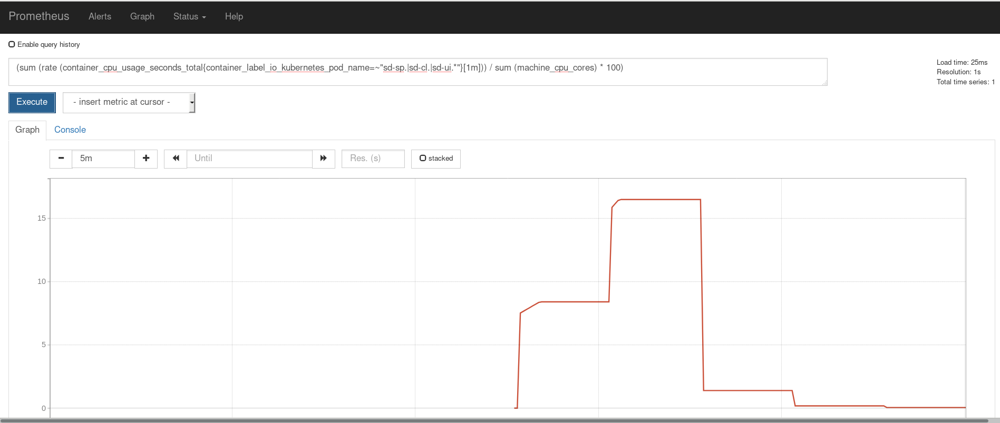
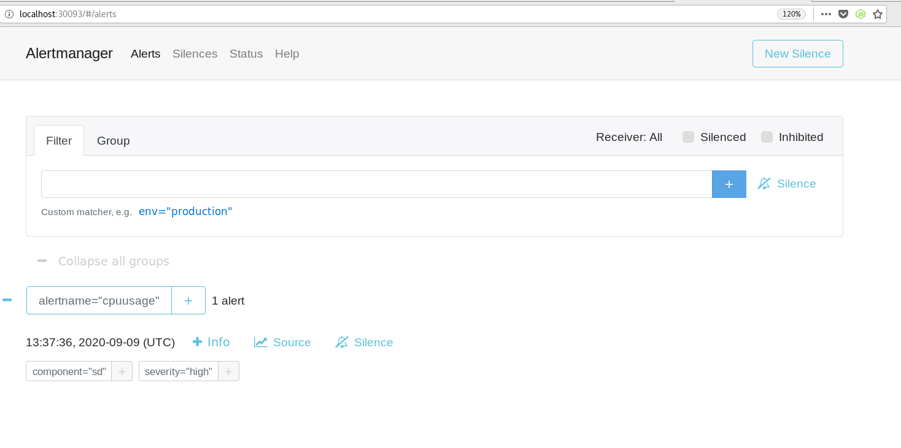
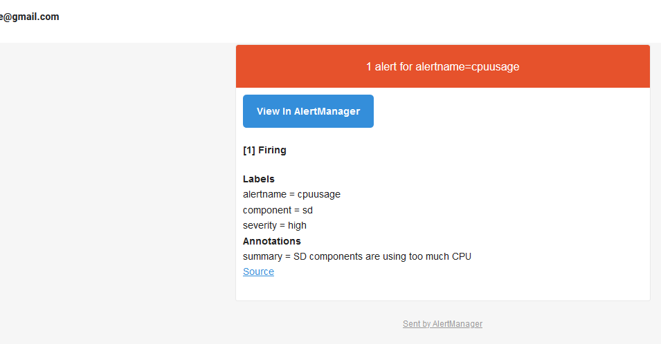

# Handling SD alerts with Prometheus
Alerting with Prometheus is optional in the SD helm chart and it is not activated by default. There is and additional container in Prometheus pod, for the Alertmanager software, that can be activated during the instalaltion of the Helm chart and it will handle the alerts sent by client applications such as the Prometheus container. It takes care of deduplicating, grouping, and routing the alerts to the correct destination such as email, Slack ,etc.. It also takes care of silencing and inhibition of alerts.

Setting up alerts with Prometheus is a two-step process:

- First, you need to create your alerting rules in Prometheus, and specify under what conditions you want to be alerted.

- Second, you need to configure Alertmanager, which receives the alerts specified in Prometheus and send them to the configured destinations. We will provide an example for Alertmanager that will be able to group alerts of similar nature into a single notification and picking which receivers receive a particular alert.

This [file](./configmap-alertmanager.yaml) contains the example of the alerting rules for Prometheus and the config file for AletManager, it should be modified and tailored to your needs. Let's review both of them:


## Create Alerting Rules in Prometheus
We create a new rules file 'sdalerts.yml' for the Prometheus container, where you will specify the conditions under which an alert must be raised.

```yaml
groups:
- name: servicedirector
  rules:
  - alert: cpuusage
    expr: (sum (rate (container_cpu_usage_seconds_total{container_label_io_kubernetes_pod_name=~"sd-sp.|sd-cl.|sd-ui.*"}[1m])) / sum (machine_cpu_cores) * 100)  > 0.05
    for: 1m
    labels:
      severity: high
      component: sd
    annotations:
      summary: SD components are using too much CPU
```

The configuration points out that if the percentage of CPU used by the SD pods is higher than 5% (of all cores) for more than one minute, then an alert will be firing. It includes labels and annotations which add additional information about the alert.


## Set up AlertManager
We will create a config file /etc/alertmanager/config.yml for the AlertManager container that includes the following:

```yaml
global:
route:
  receiver: alert-emailer
  group_by: ['alertname', 'priority']
  group_wait: 10s
  repeat_interval: 2m
  routes:
    - receiver: critical-emailer
    # Send severity=critical alerts to a different email.
      match:
        severity: critical
      group_wait: 10s
      repeat_interval: 1m
receivers:
- name: alert-emailer
  email_configs:
  - to: xxxxx@gmail.com
    from: xxxxx@gmail.com
    require_tls: true
    smarthost: smtp.gmail.com:587
    auth_username: xxxxx@gmail.com
    auth_identity: xxxxx@gmail.com
    auth_password: yourmailpassword
- name: critical-emailer
  email_configs:
  - to: xxxxx@gmail.com
    from: xxxxx@gmail.com
    require_tls: true
    smarthost: smtp.gmail.com:587
    auth_username: xxxxx@gmail.com
    auth_identity: xxxxx@gmail.com
    auth_password: yourmailpassword
```

We split the incoming alerts in two types, critical and non critical, based on the 'severity' label. Then we configure two routes, one for each type of alert, to go through an email service.
Therefore the configuration will have two email addresses: 'critical-emailer' and 'alert-emailer' , the first one for alerts labeled as 'critical' and another one for the rest of the alerts. The 'critical' ones will wait 1 minute before sending a notification again if it has already been sent successfully, the parameter 'repeat_interval' has been used for this. The rest of the alerts will wait for 2 minutes before sending a notification again.

If you use Gmail to run the example it isn’t recommended that you use your personal password for this, so you should create an App Password and paste it in the file. Some other parameters as 'require_tls' must be reviewed with your mail provider. Finally the send_resolved


## Deployment of the alert system
In order to activate the SD alerts with Prometheus you have to follow these steps:

- Deploy your personalized configmap-alertmanager.yaml file in Kubernetes, using the following command to deploy it:

      kubectl create -f configmap-alertmanager.yml --namespace monitoring

  Where 'monitoring' is the namespace where Prometheus pod will be deployed.

- Deploy the SD Helm chart using the 'prometheus.alertmanager_enabled' set to 'true'

      helm install sd-helm sd-chart-repo/sd-helm-chart --set prometheus.alertmanager_enable=true,...

Once the helm chart is deployed you can display the query used in the alert example in the Prometheus UI .You can access the UI from outside the Kubernetes cluster using the url 'http://k8scluster:30000/'  , where 'k8scluster' is the host name or IP address of your K8S cluster.



There is a graph showing the value of the query during the last few minutes.

If the values is higher than the threshold an alert will be raised, and it will be displayed in the AlerManager UI.

You can access the AlerManager UI from outside the Kubernetes cluster using the url 'http://k8scluster:30093/' , where 'k8scluster' is the host name or IP address of your K8S cluster.



If the the email accounts are configured properly you should receive an email informing of the alert:


