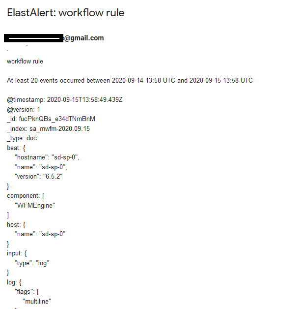
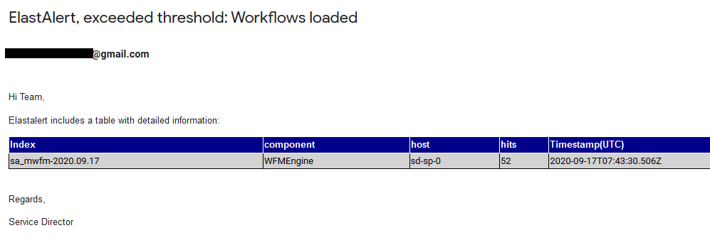
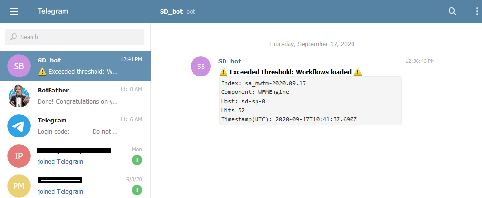

# Configuring SD alerts in EFK
Alerting with EFK is optional in the SD helm chart and it is not activated by default. There is and additional pod in EFK example that can be activated during the installation, called [Elastalert](https://github.com/Yelp/elastalert). It will query the Elasticsearch indexes and it will generate alerts based on some preconfigured rules.

This extra pod takes care of periodically querying Elasticsearch, then the data is passed to the rule which determines when a match is found. When the match occurs, it is given to one or more alerts, which take action based on the match.

You need to provide a rules file to Elastalert, it will contain the parameters to connect to Elasticsearch, the alert definition and the configured destinations. We will provide an example of the rules file,  that will be able to query Elasticsearch indexes and send an email when the alert conditions are met.

The [file](./configmap-elastlalert.yaml) contains an example of alerting rules for Elastalert and an extra file for the configured destination, it should be modified and tailored to your needs. Let's review both of them:


## Create Alerting Rules in Elastalert
This is an example of the rules file, where you will specify the conditions under which an alert must be raised. It will be stored in the Elastalert container as 'elastalert-rule.yaml'.
A basic version is the following:

```yaml
es_host: elasticsearch-service.monitoring.svc
es_port: 9200
name: workflow rule
type: frequency
index: sa_mwfm-*
num_events: 20
timeframe:
    hours: 24
filter:
- query:
    query_string:
      query: "workflow AND loaded"
      default_field: message
alert:
- "email"
email:
- "xxxxxxxxxx@gmail.com"
smtp_host: "smtp.gmail.com"
smtp_port: 587
smtp_ssl: false
from_addr: "xxxxxxxxxxxxx@gmail.com"
smtp_auth_file: '/opt/elastalert-server/config/smtp_auth_user.yaml'
```

where 'monitoring' is the namespace where EFK pods will be deployed.

The rule says that Elastalert must query the SD workflow manager logs (stored in Elasticsearch as indexes with the name 'sa_mwfm-*') and count the number of messages 'workflow XXXXXXXX loaded stored' , which give information of workflows loaded in SD. The alert will be fired if more than 20 messages arrive in a period of 24 hours.

The configured destination for the alert is an email account, in the example we selected a Gmail account but any SMTP server can be used.

Elastalert requires an additional file containing user and password in order to access the SMTP servers. The Configmap [file](./configmap-elastalert.yaml) contains the mapping for smtp_auth_user.yaml:

```yaml
user: "xxxxxxxx@gmail.com"
password: "yyyyyyyy"
```

If you use Gmail to run the example it isn’t recommended that you use your personal password for this, so you should create an App Password and paste it in the file. Some other parameters as 'smtp_ssl' must be reviewed with your mail provider.


## Deployment of the alert system
In order to activate the SD alerts with EFK you have to follow these steps:

- Deploy your personalized configmap-alertmanager.yaml file in Kubernetes, using the following command to deploy it:

      kubectl create -f configmap-elastalert.yml --namespace monitoring

  Where 'monitoring' is the namespace where Elastalert pod will be deployed.


- Deploy the SD Helm chart using the 'efk.elastalert_enabled' set to 'true'

      helm install sd-helm sd-chart-repo/sd-helm-chart --set efk.enabled=true,efk.elastalert_enabled=true,...

  The parameter 'efk.enabled=true' is also needed in order to deploy the EFK example.


## Testing the deployment
Once the helm chart is deployed you can test the status querying the rest api using the url 'http://k8scluster:30353/status', where 'k8scluster' is the host name or IP address of your K8S cluster.

You can also use the port 31401 to bind to for websockets outside the K8S cluster, for internal  connections between pods the port is 3333.

If everything is deployed properly you should receive an email to the configured account:



This email is sent from Elastalert with the raw data, but the rule can be configured to send an html formatted email with some selected fields from the alert. The new version is the following:

```yaml
es_host: elasticsearch-service.monitoring.svc
es_port: 9200
name: workflow rule
type: frequency
index: sa_mwfm-*
num_events: 20
timeframe:
    hours: 24
filter:
- query:
    query_string:
      query: "workflow AND loaded"
      default_field: message
alert:
- "email"
email:
- "xxxxxxxxxx@gmail.com"
smtp_host: "smtp.gmail.com"
smtp_port: 587
smtp_ssl: false
from_addr: "xxxxxxxxxxxxx@gmail.com"
smtp_auth_file: '/opt/elastalert-server/config/smtp_auth_user.yaml'
email_format: html
alert_text_type: alert_text_only
alert_text: |
    <html>
    <body>
        <p style="text-align:left;">Hi Team,</p>
        <p>Elastalert includes a table with detailed information:</p>
        <table style="font-family:arial, sans-serif;border-collapse:collapse;;width:80%">
            <tr style="background-color:darkblue; color:white;">
            <th style="border:1px solid;text-align:left;">Index</th>
              <th style="border:1px solid;text-align:left;">component</th>
              <th style="border:1px solid;text-align:left;">host</th>
              <th style="border:1px solid;text-align:left;">hits</th>
              <th style="border:1px solid;text-align:left;">Timestamp(UTC)</th>
            </tr>
            <tr style="background-color:lightgray; color:black;>
              <td style="border:1px solid;text-align:left;"> {} </td>
              <td style="border:1px solid;text-align:left;"> {} </td>
              <td style="border:1px solid;text-align:left;"> {} </td>
              <td style="border:1px solid;text-align:left;"> {} </td>
              <td style="border:1px solid;text-align:left;"> {} </td>
            </tr>
        </table>
        <br/>
        <p style="text-align:left;">Regards,</p>
        <p style="text-align:left;">Service Director</p><br/>
    </body>
    </html>
alert_text_args: [_index, "component[0]" , host.name, num_hits, "@timestamp"]
```

As the rule is now configured to add some html formatting, the same email can be sent with a table containing some fields defined in the workflow manager log stored in EFK. As you can see now the email is more readable:




## Adding more destinations
Elastalert supports more destinations that can be configured in a similar way to the email example, for instance we can configure a rule to send a notification to a predefined Telegram username or channel. The body of the notification is formatted following the same patterns as previous examples:

```yaml
alert:
- "telegram"
telegram_bot_token: 1344021336:AAHhXGIQfa5vgZ3Qu2ychA5Y0lXhZqlPGqo
telegram_room_id: "1159522912"
alert_text_type: alert_text_only
alert_text: |
    Index: {}
    Component: {}
    Host: {}
    Hits {}
    Timestamp(UTC): {}
alert_text_args: [_index, "component[0]" , host.name, num_hits, "@timestamp"]
```

In this case the alerter requires two new parameters:

    telegram_bot_token: The token is a string that will be required to authorize the bot and send requests to the Bot API.

    telegram_room_id: Unique identifier for the target chat or username of the target channel using telegram chat_id

We will use a Telegram channel, which will receive alerts sent by a Telegram bot. In order to prepare the bot, we need a Telegram account and use the Bot Father (@BotFather) to create the bot.

Once it the new destination is configured in the 'elastalert-rule.yaml' file and the pod is started we will received messages in the mobile's Telegram app or the web ui client, like in this screenshot:


