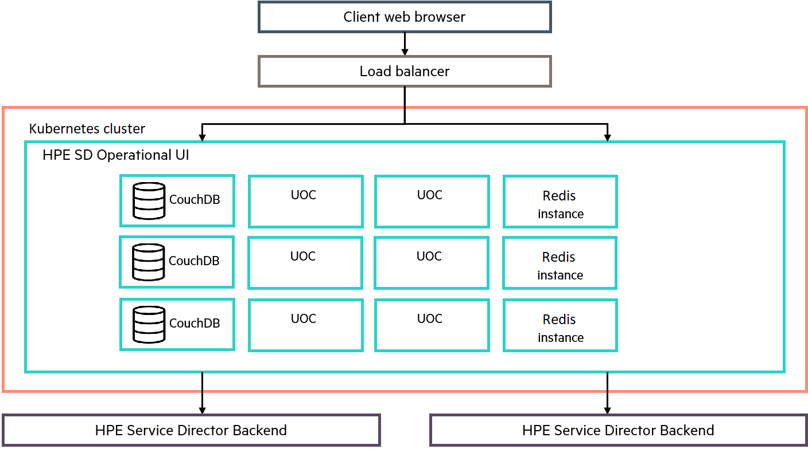
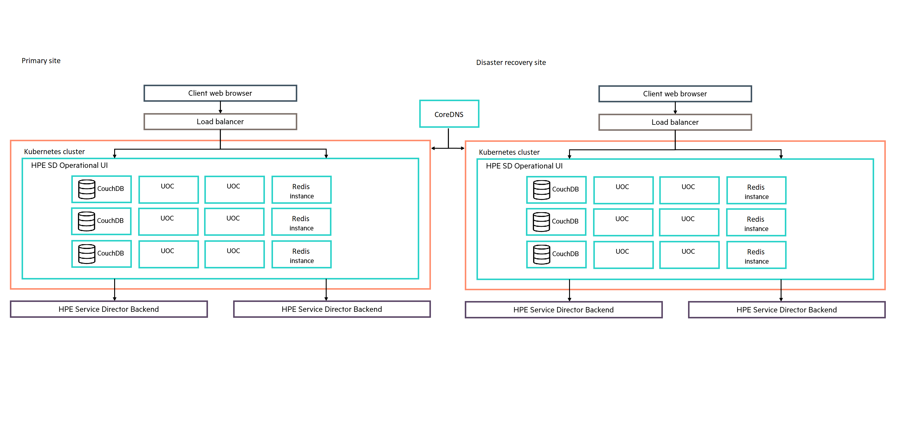
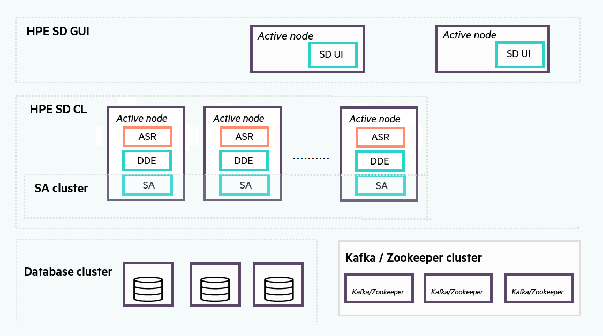

# Production deployment guidance


**Table of Contents**


  - [Sizing Provisioning](#sizing-provisioning)
    - [Assumptions](#assumptions)
    - [High availability deployment](#high-availability-deployment)
    - [Geo redundant deployment](#geo-redundant-deployment)
    - [Sizing based on workflows](sizing-based-on-workflows)
    - [Scalability example](#scalability-example)
      
  - [Sizing Operational UI](#sizing-operational-ui)
     - [Assumptions](#assumptions)
     - [High availability deployment](#high-availability-deployment)
     - [Geo redundant deployment](#geo-redundant-deployment)
     - [Scaling the Operational User Interface](#scaling-the-operational-user-interface)

   - [Sizing Closed Loop](#sizing-closed-loop)
     - [High Availability (HA) deployment](#high-availability-ha-deployment)
     - [RAM and CPU sizing](#ram-and-cpu-sizing)

   - [Running in multiple zones](#running-in-multiple-zones)


# Sizing Provisioning

This chapter details the different deployment and sizing approaches for HPE SD Provisioning.

## Assumptions


You need to have a Kubernetes cluster running version 1.18.0 or later, using an older version of Kubernetes is not supported. 

The following databases are supported for HPE SD Provisioning:

  - Oracle 12.2c and 18c

  - EDB Postgres Plus Advanced Server 11.4 (EPAS)
  
  - Postgres 11.5 or later

Additional information can be found in in HPE Service Director user manual -> Installation & Configuration -> Sizing Provisioning


## High availability deployment

For an HA architecture, the following configuration is required by default:

 - A K8S cluster with a minimum of three worker nodes with at least 8 CPU cores and 16 GB ram each one for running HPE SD Provisioning instances

 - Two machines with the Oracle RAC 12.2c database (EPAS 11.4 or Postgres 11 can be also used)

Persistent storage is activated by default in the pods they needed and it is handled with a StorageClass object that must be created prior to deployment, the default name is "sdstorageclass". The redis cluster starts with 1001 user and group, therefore you need to adjust the permissions of your data folder before deployment. You can do it executing this command:

     sudo chown -R 1001:1001 /data-folder/


The default deployment contains 6 UI replicas and 2 provisioner replicas, both values can be modified with the parameters "statefulset_sdsp.replicaCount" and "deployment_sdui.replicaCount"

To better tolerate node failures it is recommended to apply some affinty/antiaffinity policies to your deployment. The parameter sdimage.affinity is included in the Helm chart and it can contain the policy you want to apply.

You can also use the PodTopologySpread scheduling plugin for advance managing of distribution of pods. The parameter sdimage.topologySpreadConstraints is included in the Helm chart and it can contain the policy you want to apply. It is recommended to spread your provisioning instances through all the available Kubernetes nodes.

A load balancer for the connections between the SD-UI pods and the SD-SP or SD-CL pods can be activated during deployment. It is recommended to activate it with the parameter sdui_image.loadbalancer=true in order to achieve an optimal distribution of SD-UI sessions between the SD-SP and SD-CL available instances.

## Geo redundant deployment

HPE SD Provisioning can be configured in a secondary Kubernetes cluster as a warm replica of a failover instance. This replica hosts another installation of HPE SD Provisioning following the same architecture and connectivity requirements. Only the primary site is active. If it goes down, the warm replica at the disaster recovery site can be started and it acts as primary.

To synchronize both sites, HPE SD Provisioning can be deployed with the following architecture based on the HA and geo-redundancy approaches:

<p align="center">
  
</p>	


## Sizing based on workflows


#### Scaling KPIs

To have an indication of how to size the system, two KPIs are used:

  - The Number of requests per day. This refers to the number of requests being processed daily by HPE SD Provisioning. Number of requests per second can substitute this KPI.

  -  The Number of service instances. This refers to the number of services being instantiated and determines the amount of space required by HPE SD Provisioning database.

#### Sizing

With the default proposed architecture, the Number of requests per day KPI depends on the following parameters:

  - Number of concurrent workflows an HPE SD Provisioning cluster node can process. A save assumption for this parameter is 75.

  - Average service decomposition time, which is how much time the engine would take for service decomposition when a new request is received. No workflow execution time should be taken into account for this value.

  - Average number of workflows executed per request as result of the service decomposition. We will consider that all workflows will execute concurrently.

  - Average workflow execution time, which is the amount of time a workflow takes to complete.


To calculate the exact number of requests that can be processed by each HPE SD Provisioning cluster node, the following can be applied. These values must be calculated based on the Service Model that is being used:

   - Calculate the total time to process an request = average service decomposition time + (average number of workflows executed per request * average time to execute a workflow)

   - Calculate the number of concurrent active requests = 75 / average number of workflows executed per request

   - Calculate number of requests per second = number of concurrent active requests / total time to process an request

   - Calculate number of requests per day = number of requests per second * 60 * 60 * 24

As an example, the following table shows distinct sizing scenarios for one HPE SD Provisioning cluster node with:

   - Average service decomposition time: 5 seconds

   - Average number of workflows executed per request: 3

Each line in the table indicates different values for workflow execution time, starting at 0 seconds, meaning no workflow being executed at all, up to 25 seconds:


| Avg. WF execution time (sec) | Total time to process an request (sec) | Number of concurrent active requests | Number of requests per second | Number of requests per day |
|-----|-----|-----|-----|-----|
| 0 | 5  | 25  | 5  | 43200 |
| 1 | 8  | 25  | 3 | 270000 |
| 10 | 35  | 25  | 0.7  | 61714 |
| 25 | 80  | 25  | 0.3  | 27000 |

Scaling KPI numbers should be reviewed once the Use Cases and requests complexity to be managed within this architecture are defined.


## Scalability example

The default proposed HPE SD Provisioning architecture including HA and geo-redundancy is supporting up to 150 concurrent workflows (columns showing the number of concurrent requests and number of requests per day are based on each other being decomposed in 5 seconds, executing 3 workflows, and each workflow being executed in 1 second). The CPU and memory displayed in the table are dedicated to the provisioning pods only.


| K8s NODE | CPU/vCPU |Memory (GB) | Volume storage (GB) | Concurrent workflows | Concurrent requests |  Requests per day | 
|-----|-----|-----|-----|-----|-----|-----|
| node 1 | 8 | 16  | 100  | 75  | 25  | 270000  | 
| node 2 | 8  | 16  | 100  | 75  | 25  | 270000  |


Additional information can be found in:

 - HPE Service Director user manual -> Installation & Configuration -> Sizing Provisioning -> Sizing based on workflows
 - HPE Service Director user manual -> Installation & Configuration -> Sizing Provisioning -> Sizing for an order model


<p align="center">
  
</p>

# Sizing Operational UI

This chapter details the different deployment and sizing approaches for the Operational User Interface.

## Assumptions

  - An external load balancer solution is available to balance the load on different UI pods in the Kubernetes cluster
  
  - An internal Ingress resource is available and configured to route the load to different UI pods in the Kubernetes cluster  

  - Apache CouchDB is the supported database for the Operational User Interface.
  
  - Redis is required for the notification system and session management in high-availability environments.

  - Scaling KPI numbers should be reviewed once the use cases and Orders complexity to be managed within this architecture are defined.


## High availability deployment

For an HA architecture, a minimum of six available cores and 16 GB ram are required in the K8S cluster.

Depending on the size of the K8S cluster, several UI pods will run in parallel. The recommended approach is to allocate a core processor per each HPE sd-ui instance running. For example, the default production deployment will use six cores for the six HPE sd-ui instances deployed, as shown in figure High-availability deployment architecture.

<p align="center">
  
</p>	

There are several ways to expose your HPE sd-ui pods to the outside of your Kubernetes cluster, and you'll want to select the appropriate one based on your specific use case. 

HPE sd-ui pods form no cluster and a K8S service is in charge of expose all the instances. In order to access the HPE sd-ui pods from outside the cluster a load balancer is recommended, it must be configured with sticky user sessions. The external load balancer plus and internal Ingress will distribute new requests across all HPE sd-ui instances and then keep them on their initial HPE sd-ui instance for the entire user session.


## Geo redundant deployment

The Operational User Interface supports a warm replica of a failover instance at a secondary site. This replica hosts another installation of the Operational User Interface following the same architecture and connectivity requirements. Only the primary site is active. If it goes down, the warm replica at the disaster recovery site can be started and act as primary.

To synchronize both sites, the Operational User Interface can be deployed with the following architecture based on the HA and geo-redundancy approaches:

<p align="center">
  
</p>	


#### Apache CouchDB

The CouchDB stores the following information:

  - Workspaces: Set of views associated to a functionality

  - Views Definition: Specific layout definition associated to a workspace

  - User Customization Views: User customization on an existing view, for example, Search Criteria

Synchronization between active and disaster recovery sites is not mandatory for the Operational User Interface information stored in the CouchDB, because this does not contain critical data. Only if the user preferences are required to be synchronized, a periodic synchronization mechanism should be considered between both sites (for example, with one synchronization per night). For additional details on synchronization, see Apache CouchDB 2.0 Documentation at: http://docs.couchdb.org/en/latest/index.html.

#### Load balancing

Load balancers provide the ability to do the following:

  - Balance load between the multiple active instances of the Operational User Interface

  - Switch over to point disaster recovery environment when active instances are lost

For the load balancing functionality, any load balancer solution supporting HA can be used, for example, HAProxy or F5 Local Traffic Manager (LTM).

The load balancer must be configured with sticky sessions to distribute new sessions across all HPE sd-ui instances and then to keep them on their initial HPE sd-ui instance.


## Scaling the Operational User Interface

#### Scaling KPIs

To have an indication of how to size the system, the Number of concurrent users KPI is used. This refers to the number of users accessing and operating the Operational User Interface in parallel, and determines the size and number of Operational User Interface pod instances.


#### Assumptions

The following assumptions are considered for the Operational User Interface scalability:

  - HPE sd-ui v3 handles 50-100 concurrent users per instance.

  - No synchronization is required between the active site and the disaster recovery site. Only HPE sd-ui deployments should be replicated in both sites.

  - Single-thread architecture fixed by NodeJS (one core per HPE sd-ui instance).

  - Synchronization between nodes is based on replication procedures provided by CouchDB.

#### Scalability example

Based on the assumptions listed in section Assumptions, the default deployment architecture is scaled for the following KPIs on the active site:


| K8s NODE | CPU/vCPU |Memory (GB) | Volume storage (GB) | Concurrent users | 
|-----|-----|-----|-----|-----| 
| node 1 | 6  | 16  | 100  | 300  |
| node 2 | 6  | 16  | 100  | 300  |

The CPU and memory displayed in the table are dedicated to the UI pods only.

The recommended HPE sd-ui size per node is supporting 300 concurrent users using the Operational User Interface. Considering this assumption, the number of HPE sd-ui nodes could be increased depending on customer requirements.

Therefore, for a possible scenario of around 900 concurrent users, the architecture should include an additional node (node 3) with the same hardware requirements as detailed in the previous table.

<p align="center">
  
</p>


# Sizing Closed Loop

## High Availability (HA) deployment

The following figure shows the recommended HA deployment:


<p align="center">
  
</p>


There are several SD-CL nodes, all of then are active and they do all the processing (calculation of SQI values, invocation of Operations, and so on). All SD-CL nodes rely on a common Kafka/Zookeeper cluster made of 3 nodes , therefore a K8S cluster with a minimum of three worker nodes is needed to accommodate each pod of the Kafka/Zookeeper cluster.

This Kafka/Zookeper cluster stores the notification Events coming from the Network Management Systems.


## RAM and CPU sizing
#### Kafka/Zookeeper

For each K8S worker node hosting a Kafka/Zookeeper cluster node, the following resources are needed for the Kafka/Zookeeper pods only: 0.5 vCPU, 0.5 GB memory.

#### HPE SD Closed Loop backend

Today, each HPE SD Closed Loop node runs on a HPE SD Provisioning node, thus the following sizing applies in addition to the recommended sizing for HPE SD Provisioning nodes:

  - No extra CPU is required for HPE SD Closed Loop, which means that you can rely on the number of cores recommended in the Sizing Provisioning section and more specifically in the Geo-redundant deployment section.

 -  The additional RAM needed by HPE SD Closed Loop node depends on the number of ASR parameters you have or plan to have in your HPE SD Provisioning service inventory. The following formula gives the memory peak consumption for the Java process ($ ps -ef | grep HPSA) embedding the HPE SD Closed Loop solution:

      MemPeak Gb = 5.5 * NbAsrParams / 1000000 + 2 Gb

Where: - NbAsrParams = total number of Events and Facts (can be obtained precisely with the query SELECT count(*) FROM dde_service WHERE forasr__ =1 )

As an example, if there are 1 million ASR parameters to be loaded by the HPE SD Closed Loop solution into ASR database tables, the maximum memory used by the Java process is 7.5 G.

Once you have calculated this value, you can deduce the JVM_MAX_MEMORY value to be set in the /opt/HP/jboss/bin/standalone.conf configuration file (requires to restart HPE Service Activator to take into account the new setting) by multiplying the value by 2 to reduce/optimize the Java garbage collector activity:

    JVM_MAX_MEMORY = MemPeak * 2 G

Using the previous example, if you have around 1 million ASR parameters in the DDE_SERVICE table, it is recommended to have JVM_MAX_MEMORY = 7.5 * 2 = 15G. As a result for this example, we recommend to dedicate 16G RAM for each SD CL pod and use the helm chart parameter sdimage.memoryrequested=16 during deployment.

    
#### Database node storage sizing

HPE SD Closed Loop and HPE SD Provisioning both rely on the same database servers.    

Additional information can be found in HPE Service Director user manual -> Installation & Configuration -> Sizing Closed Loop -> Database node storage sizing

# Running in multiple zones

## Node behavior

You can apply node selector constraints to Pods that you create, as well as to Pod templates in workload resources such as Deployment, StatefulSet, or Job.

Service Director deployment automatically spreads some of the pods for workload resources (such as Deployment or StatefulSet) across different nodes in a cluster. This spreading helps reduce the impact of failures.

The parameter to control this behavior is called "affinity" and some pods, as in Kafka, Zookeeper, CouchDB and Redis,  already include the setup to spread the deployment in several nodes.

The provisioner instances can also spread in several nodes setting the parameters "sdimage.affinity" with the desired policy. An example of the policy can be the following:

```yaml
    podAntiAffinity:
      requiredDuringSchedulingIgnoredDuringExecution:
        - labelSelector:
            matchExpressions:
              - key: "app.kubernetes.io/sdcomponent"
                operator: In
                values:
                - provisioner
          topologyKey: "kubernetes.io/hostname"
```

You must add those labels on each node in order to tag them as  the nodes that will run the SD pods.

If your cluster spans multiple zones or regions, you can use node labels to control how SD pods are spread across your cluster. For example, you can set a constraint to make sure that the 3 replicas of he provisioner are all running in different zones to each other, whenever that is feasible. 


## Storage access for zones

You can implement zone checks for the storage using the NoVolumeZoneConflict policy , it will check that the volumes a pod requests are available in the zone.

You can specify a StorageClass for PersistentVolumeClaims that specifies the domains (zones) that the storage in that class may use. You can use the parameter "allowedTopologies" to configure a StorageClass that is aware of several domains or zones, see [this](https://kubernetes.io/docs/concepts/storage/storage-classes/#allowed-topologies )

##Networking

Kubernetes does not include zone-aware networking, if your cloud provider supports services with type=LoadBalancer, the load balancer can be configured to send traffic only to Pods running in the same zone as the load balancer managing a given connection. Check your K8S cluster configuration for details.


# Scaling up 

Kubernetes is able to perform effective autoscaling of resources for SD deployments. We will show two autoscaling approaches you can use with your SD helm chart:

## Horizontal Pod Autoscaler (HPA) 

The HPA controller can monitors the SD pods to determine if it needs to change the number of pod replicas. Usually the controller takes the mean of a per-pod metric value, it calculates whether it is needed to add or remove replicas to move the current value closer to the target value. For example, you can set in your deployment a target CPU utilization of 50%. If five pods are currently running and the mean CPU utilization is 75%, the controller will add 3 replicas to move the pod average closer to 50%.

If you want to use HPA with the provisioner you just have to create an HorizontalPodAutoscaler with the "targetCPUUtilizationPercentage" parameter to the value required and the parameter  "scaleTargetRef.name" to "sd-sp" and the parameter  "scaleTargetRef.kind" to "Statefulset" 

## Vertical Pod Autoscaling

The Vertical Pod Autoscaler (VPA) will increase or decrease the CPU and memory resource requests of pod containers to better match the allocated cluster resource allotment to actual usage.
The VPA service can set pod resource limits based on live data, rather than values set in SD Helm chart values files. Because Kubernetes does not support dynamically changing the resource limits of a running pod, the VPA terminates pods that are using outdated limits, therefore you should be cautious using this feature.

VPA uses the VerticalPodAutoscaler object to configure the scaling for a deployment or replica set. If you want VPA to manage resource requests for the SD provisioner deployment, you can use these parameters:

    kind: Statefulset
    name: sd-sp