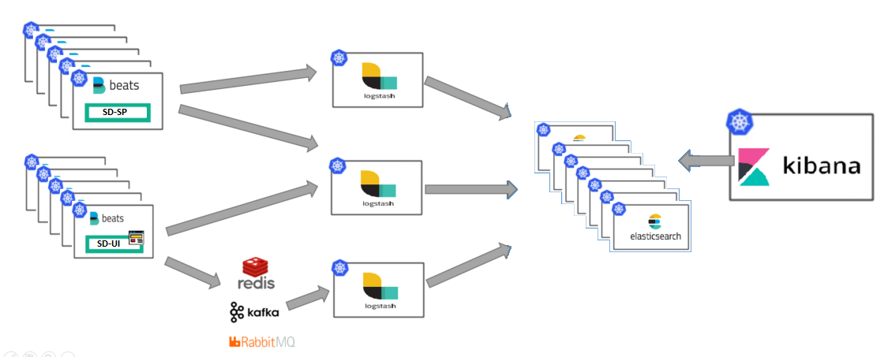
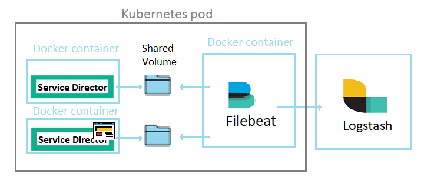

# Service Director ELK ready K8s Deployment Scenario

To ensure Service Director is available, performant and secure at all times, you can rely on the different types of logs generated. This data enables monitoring of SD and the identification and resolution of issues. 

Architecture has evolved into containers infrastructure deployed on the cloud, across clouds or in hybrid environments. The volume of logs generated by SD is constantly growing and constitutes a challenge in itself. The ELK Stack integrated with SD fulfills the needs in the log management and analytics for the platform. 

The ELK Stack helps by providing us with a powerful platform that collects and processes data from multiple SD logs, stores that data in one centralized data store that can scale as data grows, and that provides a set of tools to analyze the data. 

Elasticsearch is the main piece of the ELK stack, it is a modern search and analytics engine that stores data in a way that allows using SQL statements to interact with the data. In the context of data analysis, Elasticsearch is used together with the other components in the ELK Stack, Logstash and Kibana, and plays the role of data indexing and storage.

Kibana is the analysis and visualization tool of the ELK stack, it uses a browser ui that allows to search, inspect and visualize the data stored in Elasticsearch indices. You can review your data more closely or in different ways, using a wide variety of different charts and graphs.



 
This guide installs SD+ELK demo using basic Kubernetes commands without needing to download or install Helm. This installation lets you quickly evaluate SD+ELK in a Kubernetes cluster on any platform.

Filebeat is a lightweight component for collecting and forwarding log data. Installed as a sidecar container on the SD pod, Filebeat monitors the SD log files or locations that you specify, collects log events, and forwards them to  Logstash for indexing and transformation.

The sdv3-filebeat.yaml file defines a standard Service Director deployment for kubernetes cluster with Filebeat container attached as sidecar, it is setup to send log information to an ELK stack through Logstash. This deployment also defines a Service Director UI container and Filebeat sidecar container which also reads some log files through shared volumes. 
 


For more information about ELK, please consult [ELK](https://www.elastic.co/what-is/elk-stack) page.

**IMPORTANT**:  This configuration profile is not suitable for performance evaluation. It is designed to showcase ELK functionality with low levels of tracing and access logging.

**NOTE** A guidence in the amount of Memory and Disk for the ELK k8s installation together with the full [sd-deployment](../sd-deployment) is that it requires 8GB RAM, 4 CPUs and minimum 50GB free Disk space on the assigned k8s Node. The amount of Memory of cause depends of other applications/pods running in same node. In case k8s master and worker-node are in same host, like Minikube, then minimum 8GB RAM is required.

As a prerequisites for this deployment a database is required.

## Prerequisites
### 1. Deploy database

**If you have already deployed a database, you can skip this step! 

For this example, we bring up an instance of the `edb-as-lite` image in a K8s Pod, which is basically a clean EDB Lite image with an `enterprisedb` user ready for Service Director installation.

**NOTE** If you are not using the k8s [enterprise-db](../enterprise-db) deployment, then you need to modify the [sdv3-filebeat](sdv3-filebeat.yaml) database related environments to point to the used database.

Follow the deployment as described in [enterprise-db](../enterprise-db) directory. 

**NOTE** For production environments you should either use an external, non-containerized database or create an image of your own, maybe based on official Oracle's [docker-images](https://github.com/oracle/docker-images).

### 2. Deploy ELK stack
To deploy the ELK stack we use three K8s deployment files to bring up the ELK services.


In order to install the ELK for Service Director into k8s cluster you have to start with elasticsearch deployment:

    kubectl create -f elasticsearch.yaml

```
statefulset.apps/elasticsearch-logging created
service/elasticsearch-service created

```

then you have to deploy logstash:

    kubectl create -f logstash.yaml

```
configmap/logstash-config created
deployment.extensions/logging-logstash created
service/logstash-service created

```

finally you have to deploy kibana:

    kubectl create -f kibana.yaml

```
deployment.apps/kibana-logging created
service/kibana-service created

```

Validate when the deployed ELK stack application/pod is ready (READY 1/1)

    kubectl get pods

```
    NAME                                     READY   STATUS             RESTARTS   AGE
    elasticsearch-logging-0                  1/1     Running            0          4m12s
    kibana-logging-657f7c6fc7-8rnmq          1/1     Running            0          40s
    logstash-logging-7dd4fc7c84-z5flw        1/1     Running            0          2m12s
    
```

When the application is ready, then the deployed services are exposed with the following:

    kubectl get services
       
```
    NAME                          TYPE        CLUSTER-IP       EXTERNAL-IP   PORT(S)                         AGE
    elasticsearch-service   NodePort         10.97.199.250     <none>        9200/TCP                        7m43s
    kibana-service          NodePort         10.107.40.94      <none>        5601/TCP                        4m22s
    logstash-service        NodePort         10.96.148.115     <none>        5044/TCP                        5m54s
 
```


When the ELK pods are ready, the Kibana UI is exposed on the following url:

        http://<cluster_ip>:30033/       (Kibana UI)

**NOTE** The kubernetes `cluster_ip` can be found using the `kubectl cluster-info`.


To delete the ELK stack, run

     kubectl delete -f elasticsearch.yaml -f kibana.yaml -f logstash.yaml

```
statefulset.apps "elasticsearch-logging" deleted
service "elasticsearch-service" deleted
deployment.apps "kibana-logging" deleted
service "kibana-service" deleted
configmap "logstash-config" deleted
deployment.extensions "logstash-logging" deleted
service "logstash-service" deleted


```


### 3. Deploy SD-Filebeat

The [sdv3-filebeat.yaml](sdv3-filebeat.yaml) file contains the following containers:

- `sd-sp`             : HPE SD  - [sd-sp](/docker/images/sd-sp)
- `sd-ui`             : HPE SD UI  - [sd-ui](/docker/images/sd-ui)
- `filebeat`         : Filebeat monitors the log files or locations that you specify, collects log events, and forwards them to logstash - [filebeat](https://www.elastic.co/guide/en/beats/filebeat/current/filebeat-overview.html)

Filebeat data folder stores a registry of read status for all log files, so it doesn't send everything again to logstash on a pod restart. This folder must be a persistent storage therefore created outside the container, on the Kubernetes nodes. By the default the folder is 

     /var/lib/filebeat-data
     
The path can be found under "volumes" in sdv3-filebeat.yaml

In order to deploy the Service Director + Filebeat pod, run:

    kubectl create -f sdv3-filebeat.yaml

```
     configmap/filebeat-config created
     deployment.apps/sdsp-deployment created
     service/sdsp-nodeport created
     service/sdui-nodeport created
```
**IMPORTANT** The [sdv3-filebeat.yaml](sdv3-filebeat.yaml) file uses defines a docker registry examples (`hub.docker.hpecorp.net/cms-sd`) for the used sd-sp images. This shall be changed to point to the docker registry where the docker images are located. E.g.: (`- image: hub.docker.hpecorp.net/cms-sd/sd-sp`)


You can validate if the deployed sd-filebeat applications/pods are ready (READY 3/3)

    kubectl get pods

```
    NAME                                            READY   STATUS    RESTARTS   AGE
    sdsp-deployment-994c7cf8b-49hld                 3/3     Running   0          19h

```

When the SD pod is ready, then the deployed SD containers (SD User Interfaces) are exposed on the following urls:

        http://<kubernetes_cluster_ip>:32516/login       (Service Director UI)
      
        http://<kubernetes_cluster_ip>:32515/activator/  (Service Director native UI)

**NOTE** The kubernetes `cluster_ip` can be found using the `kubectl cluster-info`.

In order to guarantee that services are started in the right order, and to avoid a lot of initial restarts of the applications, until the prerequisites are fullfilled, this deployment file makes use of [k8s initContainers](https://kubernetes.io/docs/concepts/workloads/pods/init-containers/).
The initContianers are not mandatory. 
Further it adds k8s [RedinessProbes](https://kubernetes.io/docs/tasks/configure-pod-container/configure-liveness-readiness-probes/) and [livenessProbes](https://kubernetes.io/docs/tasks/configure-pod-container/configure-liveness-readiness-probes/) to the applications to do health check. 


You can delete the deployed sd-filebeat applications/pods with the following command:

    kubectl delete -f sdv3-filebeat.yaml

```
     configmap/filebeat-config deleted
     deployment.apps/sdsp-deployment deleted
     service/sdsp-nodeport deleted
     service/sdui-nodeport deleted
```

To delete the EDB deployment, please follow the delete procedures as described in the respective examples.


### 4. How to check SD-ELK stack is working and first steps  


Filebeat container collects the following SD log information and send it to logstash pod:


 - `SD container`    : WildFly log using the following path - /opt/HP/jboss/standalone/log/
 - `SD container`    : Service Activator losg using the following path - /var/opt/OV/ServiceActivator/log/
 - `SD container`    : SNMP adapter log using the following path - /opt/sd-asr/adapter/log/
 - `SD UI container`: UOC log using the following path - /var/opt//uoc2/logs

Those logs are collected and transformed in logstash, then are sent to elasticsearch and stored with the following index name:

        wildfly-YYYY.MM.dd    (JBoss log)
      
        sa_mwfm-YYYY.MM.dd    (Service Activator log)
        
        sa_resmgr-YYYY.MM.dd  (Service Activator log)
        
        uoc-YYYY.MM.dd        (Unified OSS Console log)


You can check if the SD logs indexes were created and stored in elasticsearch using the Kibana web interface, open the following URL in your browser: 

        http://<kubernetes_cluster_ip>:30033/
      

Then select "Elasticsearch - Index Management" under the "Management" menu. Some of the logs mentioned previously should appear.


 


Select "Kibana - Index Management" under the "Management" menu, then click on "Create Index Management" and select one of the log indexes. 


Now your log data will be available under the "Discover" menu. 


 
### Troubleshooting common problems 

- Kibana is not displaying any elasticsearch indexes.

  Check if elasticsearch pod is up and running in the same namespace of Kibana pod, also review logstash pod logs to check if connected succesfully to elasticsearch pod.
  
- Kibana is not showing some of the SD logs.

  In order to generate data in the logs some activity must be recorded in SD. Login to SD web console and perform any task.
  
- Logstash pod is restarting all the time.

  If logstash pod cannot connect to elasticsearch pod will restart after some seconds. Check that elasticsearch Service and Pod are up and running in the same namespace as logstash.    
