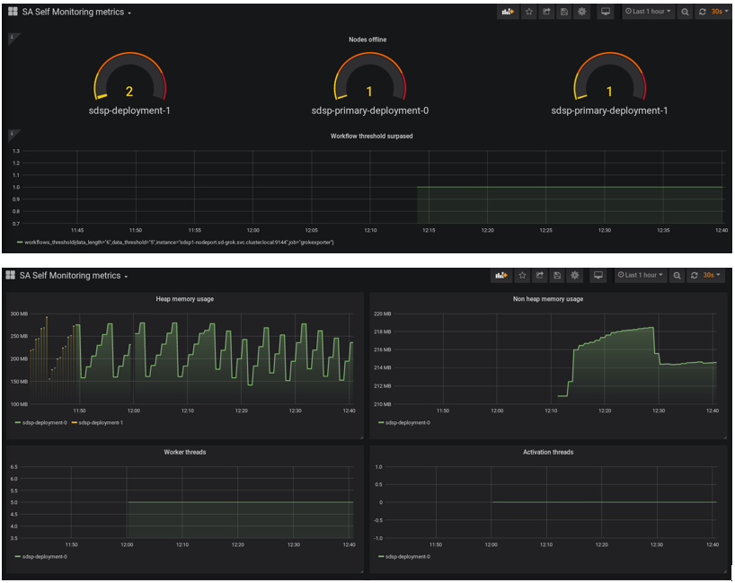
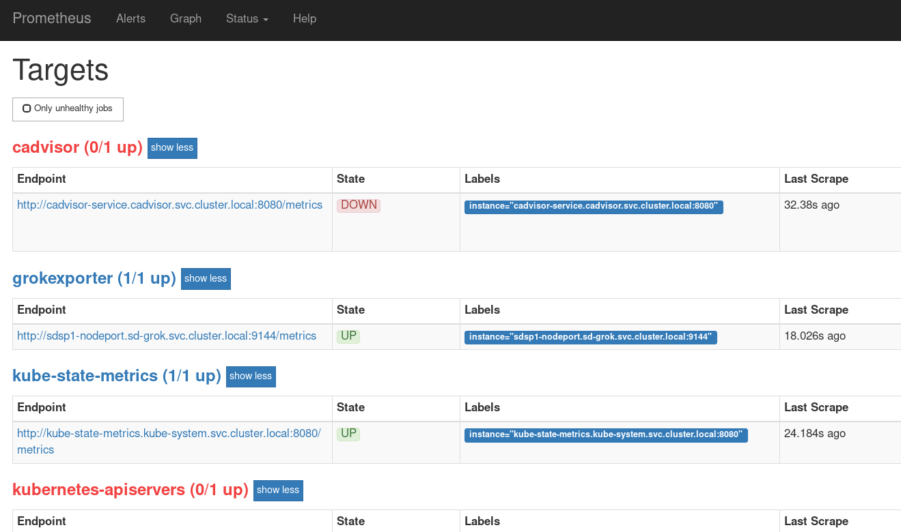

#  SD Provisioning image with Prometheus/Grafana ready K8s Deployment Scenario

Measuring performance is key to evaluating how well SD Provisioning pods are doing in a Kubernetes cluster. Good performance metrics form the basis for better achieving, as the famous quote says "you can't manage what you can't measure".

To ensure how SD Provisioning is performing in your system this examples shows how to integrate it with Prometheus. This tool does not try to solve problems outside of the metrics space, leaving those to other tools.

Prometheus is an ideal solution for stacks that rely heavily on containers and on distributed architectures as Kubernetes.It is also designed to monitor servers, databases, standalone virtual machines, pretty much everything can be monitored with Prometheus. Exporters are pieces of software responsible for collecting and exposing metrics to Prometheus for third-party software or services.

Prometheus ecosystem has dozens of different exporters that one can use in order to monitor an entire infrastructure in minutes. As architectures have evolved into containers infrastructure deployed on the cloud, across clouds or in hybrid environments, the volume of those containers, generated for Kubernetes, is constantly growing and constitutes a challenge for most companies, this example fulfills the needs in the metrics management for the HPE Service Director platform. 
 
In this example we will consider two different scenarios for SD Provisioning: 

- Export standard Kubernetes metrics using some of the prebuilt exporters:

You can extract metrics from Kubernetes objects: SD Provisioning pods health can be monitored via generic k8s exporters like [kube-state-metrics](https://github.com/kubernetes/kube-state-metrics) and [cAdvisor](https://github.com/google/cadvisor). They  are services that listens to the Kubernetes API server and generates metrics about the state of the k8s objects and containes.
The metrics are exported on its HTTP endpoint and they are served as plaintext. They are designed to be consumed by Prometheus and some personalization must be done in the query in order to extract information related to SD Provisioning pods only.

- Export personalized Service Provisioner metrics using HPE SA Self Monitor module and some additional exporters:

You can extract metrics from SD Provisioning using the Self Monitor extra module included in your installation. Self Monitor saves metrics in a table of the database and some extra alerts can be configured to be saved to a log file. The log file can be exported as metrics with the [grok_exporter](https://github.com/fstab/grok_exporter) tool, it is a simple service that can be attached as a sidecar container inside the SD Provisioning pod. 
The Self Monitor data in the SDSP DB tables can be exposed to Prometheus via the exporter [SQL Exporter](https://github.com/free/sql_exporter) using some predefined SQL queries.

Grafana is a tool that displays temporary series of data, it uses a browser ui that allows to inspect and visualize the metrics stored in Prometheus. You can review your metrics more closely or in different ways, using a wide variety of different charts and graphs.

Prometheus and Grafana make it extremely easy to monitor just about any metric in your Kubernetes cluster, they can be deployed alongside "exporters" to expose cluster-level Kubernetes object metrics as well as machine-level metrics like CPU and memory usage.

There are a number of libraries which help in exporting existing metrics from third-party systems as Prometheus metrics. Exporters are useful for cases where it is not feasible to expose Prometheus metrics directly in the software you are using.

This guide installs SD Provisioning, Prometheus, Grafana and the exporters for SD Provisioning using basic Kubernetes commands without needing to download or install Helm. This installation lets you quickly evaluate SD Provisioning+Prometheus in a Kubernetes cluster on any platform.

**IMPORTANT**:  This configuration profile is not suitable for performance evaluation. It is designed to showcase Prometheus+Grafana functionality with low levels of metrics and logging.

**NOTE**: A guidance in the amount of Memory and Disk for the k8s installation together with the full [sd-deployment](https://github.hpe.com/hpsd/sd-cloud/tree/master/kubernetes/examples/sd-ha-edb-deployment) is that it requires 8GB RAM, 4 CPUs and minimum 50GB free Disk space on the assigned k8s Node. The amount of Memory of cause depends of other applications/pods running in same node. In case k8s master and worker-node are in same host, like Minikube, then minimum 8GB RAM is required.

As a prerequisites for this deployment a database is required.

## Prerequisites
### Deploy database

**If you have already deployed a database, you can skip this step! 

For this example, we bring up an instance of the `edb-as-lite` image in a K8s Pod, which is basically a clean EDB Lite image with an `enterprisedb` user ready for Service Director installation.

**NOTE** If you are not using the k8s [enterprise-db](../enterprise-db) deployment, then you need to modify the [sd-grokexporter.yaml](./grokexporter/sp-grokexporter.yaml) database related environments to point to the used database.

Follow the deployment as described in [enterprise-db](../enterprise-db) directory. 

**NOTE** For production environments you should either use an external, non-containerized database or create an image of your own, maybe based on official Oracle's [docker-images](https://github.com/oracle/docker-images).

### 1. Deploy Prometheus
The Prometheus server must be configured so that it can discover endpoints for metrics, this example will guide you through the steps needed to deploy a properly configured Prometheus server.

All the files needed in this stage are included in the [prometheus](./prometheus/) subfolder.

Prometheus, Grafana and most of the exporters will run in the same namespace, therefore the following command creates the namespace:

    kubectl create -f namespace.yaml

Running the following commands deploys Prometheus in Kubernetes:

    kubectl create -f clusterRole.yml
    kubectl create -f configmap.yml
    kubectl create -f prometheus-deployment.yml    

The file [configmap.yml](./prometheus/configmap.yml) contains the connection urls to the exporters. 

### 2. Deploy SD Provisioning + Grok Exporter

To expose some SD Provisioning logs as standard metrics for Prometheus we use Grok Exporter as a sidecar container inside SD Provisioning pod. 

 [Grok exporter](https://github.com/fstab/grok_exporter) does not have an official Docker image distribution, therefore in order to use you have to generate your own Docker image. A Dockerfile an all the files needed are included in the [grokexporter\docker](./grokexporter/docker/) subfolder to help you with that.
 
 
Running the following command from the [grokexporter\docker](./grokexporter/docker/) subfolder will generate de Docker image:

    docker build -t grok_exporter:latest . 

The deployment file [sdsp-grokexporter.yaml](./grokexporter/sdsp-grokexporter.yaml) contains a ConfigMap with the configuration file for Grok Exporter. This files comes with two preconfigured metrics extracted from Self Monitor log.

All the files needed for the SD Provisioning+Grok deployment are included in the [grokexporter](./grokexporter/) subfolder.

Running the following commands deploys SD Provisioning+Grok in Kubernetes:

    kubectl create -f sp-grokexporter.yaml

### 3. Deploy Exporters for standard SD Provisioning Kubernetes metrics

To capture the standard SD Provisioning metrics we use two different exporters. They are needed if you want to use the included examples of Grafana dashboards for SD Provisioning.

The two included exporters are the following:

 - cAdvisor [container advisor](https://github.com/google/cadvisor) is a running daemon that collects, aggregates, processes, and exports to Prometheus the metrics of the resource usage and performance characteristics of the running containers in Kubernetes.

All the files needed for the cAdvisor deployment are included in the [cadvisor](./cadvisor/) subfolder.
Running the following commands deploys the exporter in Kubernetes:

    kubectl create -f clusterrole.yaml
    kubectl create -f clusterrolebinding.yaml
    kubectl create -f podsecuritypolicy.yaml
    kubectl create -f serviceaccount.yaml
    kubectl create -f service.yaml
    kubectl create -f daemonset.yaml

 - [kube-state-metrics](https://github.com/kubernetes/kube-state-metrics) is a deployment running in the kube-system namespace, it is a simple service that listens to the Kubernetes API server and generates metrics about the state of the Kubernetes objects. It is not focused on the health of the individual Kubernetes components, but rather on the health of the various objects inside, such as deployments, nodes and pods

All the files needed for the ksm deployment are included in the [ksm](./ksm/) subfolder.
Running the following commands deploys ksm in Kubernetes:

    kubectl create -f cluster-role.yaml
    kubectl create -f cluster-role-binding.yaml
    kubectl create -f podsecuritypolicy.yaml
    kubectl create -f service-account.yaml
    kubectl create -f service.yaml
    kubectl create -f deployment.yaml

### 4. Deploy Exporters for Self Monitor Kubernetes metrics

To capture the standard SD Provisioning metrics we use two different exporters.They are needed if you want to use the Grafana "Self Monitor metrics" dashboard. 

The two included exporters are the following:

 - [SQL Exporter](https://github.com/free/sql_exporter) is a configuration driven exporter that exposes metrics gathered from DBMSs, for use by the Prometheus monitoring system. Out of the box, it provides support for EnterpriseDB but any DBMS for which a Go driver is available may be monitored after rebuilding the binary with the DBMS driver included.
 
   Service Activator Self Monitor tool saves performance metrics in a table of SA database, this exporter connects to the table and exports the metrics in a format suitable for Prometheus.
   The deployment file  [sdsp-grokexporter.yaml](./grokexporter/sdsp-grokexporter.yaml) contains a ConfigMap with a Self Monitor config file. This file is configured to write an alarm in the log file when a very small threshold in the number of pending workflows is reached.

All the files needed for SQL Exporter deployment are included in the [sqlexporter](./sqlexporter/) subfolder.
Running the following commands deploys the exporter in Kubernetes:

    kubectl create -f configmap.yml
    kubectl create -f deployment.yml

**NOTE**: This configuration profile is setup to work with a EnterpriseDB database, if you want to use an Oracle database you have to add some Oracle Go sql driver, like [ora.v4](https://github.com/rana/ora/tree/v4.1.15), to the [SQL Exporter](https://github.com/free/sql_exporter) source code and rebuild the binary with the source code of the DBMS driver included. Alternatively another exporter, customized for Oracle databases, can be used like the [Oracle Exporter](https://github.com/iamseth/oracledb_exporter), using the same SQL queries and metrics names so the data exposed to Prometheus will be the same as in this example.

 - [Grok Exporter](https://github.com/fstab/grok_exporter) is a tool to parse unstructured log data into structured metrics. It is included as a sidecar container in the SD Provisioning pod.
 
   Service Activator Self Monitor tool saves alerts in a log file, this exporter reads the log file and exports the metrics in a format suitable for Prometheus.
   
   
### 5. Deploy Grafana

Grafana is an open source project for visualizing time-series data, the official Grafana image on DockerHub works out-of-the-box for this example with Kubernetes. To deploy Grafana we use a statefulset and a nodeport service to expose the UI out of the K8s cluster.

All the files needed in this stage are included in the [grafana](./grafana/) subfolder.

Running the following commands deploys Grafana in Kubernetes:

    kubectl create -f grafana-service.yaml
    kubectl create -f grafana-sts.yaml    

Once the pod is running You can access to the Grafana interface using the exposed service URL:

       http://<kubernetes_cluster_ip>:30033/

### 6. Deploy Grafana dashboards

Dashboards are exported to files in Grafana JSON format, and contain everything you need (layout, variables, styles, data sources, queries, etc) to import them. The [grafana](./grafana) folder contains two json files with a configured Grafana dashboard.

- Importing a dashboard
  To import a dashboard open dashboard search and then hit the import button.
  
  

   From here you can upload a dashboard json file, paste a Grafana.com dashboard url or paste dashboard json text directly into the text area.
   
   
   
   Click on Import an select the file "Kubernetes SP metrics.json" included in the [Grafana](./grafana) folder
   
   Some of the charts you can find in this dashboard are the following:
   
  

   
   
   Click on Import an select the file "SA Self Monitoring metrics.jsonn" included in the [Grafana](./grafana) folder

   Some of the charts you can find in this dashboard are the following:
   
  
  
  
  In the [grafana subfolder](./grafana) you will find more information about each graph you can find in the two dashboards. 
  

### 7. Self Monitor alerts activation  

The SD Provisioning deployment file "sp-grokexporter.yaml" contains a ConfigMap with the Self Monitor config file. For demo purposes this file is configured to write an alarm in the log file when a very small threshold in the number of pending workflows is reached .

### 8. How to check SD Provisioning-Prometheus-Grafana stack is working and first steps  

You can check if the metrics were created and stored in Prometheus using the web interface, open the following URL in your browser: 

        http://<kubernetes_cluster_ip>:30000/target

   
The configured exporters should appear on the screen, with the active exporters in BLUE and the exporters with errors in RED.

 
 

You can check if the metrics created are displayed properly in Grafana using the web interface. Open the following URL in your browser: 

       http://<kubernetes_cluster_ip>:30033/

 
Select "Dashboards - Manage" under the menu, then click one of the two SD Provisioning installed dashboards. 

 
### Troubleshooting common problems 

- Grafana is not displaying some metrics in the dashboard.

  Check if exporter pods are up and running, also review Prometheus pod logs to check if they connect succesfully to exporters.
  

