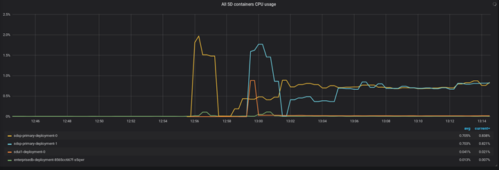
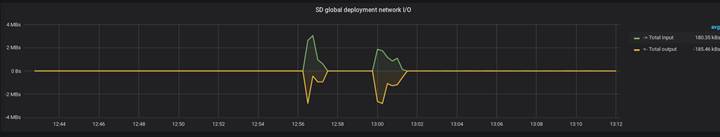

# Grafana dashboards additional Information

This folder contains the Grafana dashboards included in the example and th k8s deployment files.

## Kubernertes SP metrics dashboard

The following graphs shows metrics of the "Kubernertes SP metrics" dashboard during the following scenario:

- A DB instance is created for the SA cluster.
- A SA instance is created after the DB instance is up 
- A UOC instance is created after the SA instance is up
- Some minutes after the first SA instance is up, a second SA instance is created  

Main metrics after the deployment of two instances of SA 
-	Nearly 2 Gibs are used in the Kubernetes cluster
-	Nearly two cores are used for a standby SD cluster
-	2 available SA instances are available in the cluster

  
  
Combined CPU usage of all pods in the deployment (SA+UOC+DB)
-	A first CPU burst is generated due to first SA node deployment
-	A second CPU burst is generated due to second SA node deployment
-	A sustained CPU usage remains after second SA node deployment (standby SA cluster)

  
  
CPU usage of two instances of SA 
-	A first CPU burst is generated due to first SA node deployment
-	A second CPU burst is generated due to second SA node deployment
-	Sustained CPU usage remains after each node deployment (standby SA cluster)

      

Individual CPU usage of all pods in the deployment (SA+UOC+DB) 
-	the yellow line is first CPU burst is generated due to first SA node deployment
-	the blue line is second CPU burst is generated due to first SA node deployment
-	the red line is CPU burst is generated due to UOC node deployment 

  
  
Total memory usage during the deployment of two instances of SA 
-	the green  line is is memory usage of 2 Sas + UOC + DB
-	Sustained CPU usage remains after each node deployment (standby SA cluster)

    

Individual memory usage of every container during the deployment of two instances of SA 
-	the yellow line is memory usage of SA first instance 
-	the blue line is memory usage of SA second instance
-	the orange line is memory usage of UOC instance
-	the green line is memory usage of DB instance

  
  
Total network traffic during the deployment of two instances of SA 
-	the two green line bursts are inbound traffic on DB instance coming from SA instances during setup
-	the two yellow line burst are outbound traffic of SA instances towards DB during setup

    
  
Network traffic of every container during the deployment of two instances of SA  
-	the yellow line is outbound traffic of SA first instance towards DB during setup
-	the blue line is outbound traffic of SA second instance towards DB during setup
-	the red lines is inbound traffic of DB instance during SA setup
-	there is some outbound traffic (yellow)  of first SA instance during SA second instance setup

      
  
  
## Kubernertes SP metrics dashboard

The following graphs shows metrics of the "SP Self Monitoring metrics" dashboard during the following scenario:

- A DB instance is created for the SA cluster.
- A SA instance is created after the DB instance is up 
- After the first SA instance is up, several SA instances are created and some scale up/down is done   
- A very low workflow threshold was setup in the Self Monitor config to raise some alerts quickly 

Main metrics after some scaling up/down of SA nodes 
-	Information of what SA nodes have been down and how many times 
-	A workflow alert threshold was raised 

  
  
Resource usage graphs recorded by SP Self Monitoring
-	First graph (top left) displays Heap memory usage per SA node 
-	Second graph (top right) displays Non heap memory usage per SA node
-	Third graph (bottom left) displays worker threads per SA node
-	Fourth graph (bottom right) displays activation threads per SA node

    
  
Resource usage graphs recorded by SP Self Monitoring
-	First graph (top left) displays activation queue size per SA node 
-	Second graph (top right) displays total jobs per SA node
-	Third graph (bottom left) displays user sesions per SA node

      