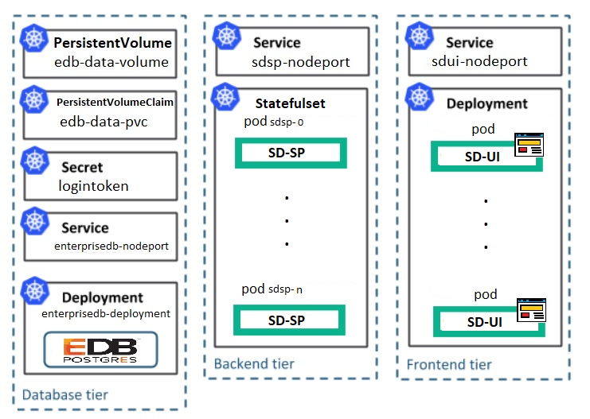

# Service Director HA K8s Deployment Scenario

This Deployment file defines a standard Service Director HA for kubernetes cluster with two provisioning nodes each having a Service Director UI on top as well.

As Service Director requires an external database as well, for the purpose of this example we are bringing up an instance of the `EnterpriseDB lite` image in a K8s Pod, which is basically a clean Enterprise DB image with an `enterprisedb` user ready for Service Director installation.  For production environments you should either use an external, non-containerized database or create an image of your own, maybe based on official EnterpriseDB's [docker-images](https://containers.enterprisedb.com).

The [sd-ha-edb-deployment.yaml](sd-ha-edb-deployment.yaml) file contains the following deployments (k8s-Pods):

- `enterprisedb-deployment`: fulfillment database server 
- `sdsp-primary-deployment`: primary provisioning node - [sd-sp](/docker/images/sd-sp)
- `sdsp-secondary-deployment`: secondary provisioning node - [sd-sp](/docker/images/sd-sp)
- `sdui1-deployment`: UOC-based UI connected to `sdsp-primary-deployment` Service Director - [sd-ui](/docker/images/sd-ui)
- `sdui2-deployment`: UOC-based UI connected to `sdsp-secondary-deployment` Service Director - [sd-ui](/docker/images/sd-ui)



The following services are exposed to external ports in the k8s cluster:
- `enterprisedb-nodeport`-> `30021`: EnterpriseDB listener port
- `sdsp1_nodeport`     -> `32514`: Service Director native UI (primary node)
- `sdsp2_nodeport`     -> `32415`: Service Director native UI (secondary node)
- `sdui1_nodeport`     -> `32516`: Unified OSS Console (UOC) for primary Service Director
- `sdsui2_nodeport`     -> `32517`: Unified OSS Console (UOC) for secondary Service Director

In order to guarantee that services are started in the right order, and to avoid a lot of initial restarts of the applications, until the prerequisites are fullfilled, this deployment file makes use of [k8s initContainers](https://kubernetes.io/docs/concepts/workloads/pods/init-containers/).
The initContianers are not mandatory. 
Furhter it adds k8s [RedinessProbes](https://kubernetes.io/docs/tasks/configure-pod-container/configure-liveness-readiness-probes/) and [livenessProbes](https://kubernetes.io/docs/tasks/configure-pod-container/configure-liveness-readiness-probes/) to the applications to do health check. If you are using an external database, you may remove the `enterprisedb-deployment` deployment and the `enterprisedb-nodeport` from the file and adjust `SDCONF_hpsa_db_`-prefixed environment variables as appropriate for the `sdsp-primary-deployment` and the `sdsp-secondary-deployment`, also you need to make sure that your database is ready to accept connections before deploying the k8s [sd-ha-deployment](sd-ha-edb-deployment.yaml).


**IMPORTANT** The [sd-ha-edb-deployment.yaml](sd-ha-edb-deployment.yaml) file defines a docker registry examples (`hub.docker.hpecorp.net/cms-sd`) for the used images. This shall be changed to point to the docker registry where the docker images are located. E.g.: (`- image: hub.docker.hpecorp.net/cms-sd/sd-sp`)

**NOTE** A guidence in the amount of Memory and Disk for the sd-ha K8s deployment is that it requires 2GB RAM and minimum 5GB free Disk space on the assigned K8s nodes running the `sdsp-primary-deployment`, `sdsp-secondary-deployment`, `sdui1-deployment` and the `sdui2-deployment`. For the node running the `enterprisedb-deployment` it requires 4GB RAM and minimum 12GB Disk Size. The amount of Memory of cause depends of other applications/pods running in same node. In case K8s master and worker-node are in same host, like Minikube, then minimum 8GB RAM and 20GB Disk is required.


In order to deploy the Service Director HA Provisioning K8s deployment, run

    kubectl create -f sd-ha-edb-deployment.yaml

```
    persistentvolume/edb-data-volume created
    persistentvolumeclaim/edb-data-pvc created
    secret/logintoken created
    deployment.apps/enterprisedb-deployment created
    service/enterprisedb-nodeport created
    deployment.apps/sdsp-primary-deployment created
    service/sdsp1-nodeport created
    deployment.apps/sdui1-deployment created
    service/sdui1-nodeport created
    deployment.apps/sdsp-secondary-deployment created
    service/sdsp2-nodeport created
    deployment.apps/sdui2-deployment created
    service/sdui2-nodeport created
```

Validate when the deployed sd-ha applications/pods are ready (READY 1/1)

     kubectl get pods

```
     NAME                                        READY   STATUS    RESTARTS   AGE
     enterprisedb-deployment-76d5c4cd66-mvrzl    1/1     Running   0          20m
     sdsp-primary-deployment-74ff658f7d-bb8hv    1/1     Running   0          20m
     sdsp-secondary-deployment-ddbc6b499-ddp9t   1/1     Running   0          20m
     sdui1-deployment-65cb7dc8f7-8f2px           1/1     Running   0          20m
     sdui2-deployment-7d76b6f4bf-5bcwj           1/1     Running   0          20m
```

When the SD HA applications are ready, then the deployed services (SD User Interfaces) are exposed on the following urls:

      Service Director Primary:
      	http://<cluster_ip>:32516/login       (Service Director UI)
      
      	http://<cluster_ip>:32514/activator/  (Service Director native UI)

      Service Director Secondary:
      	http://<cluster_ip>:32517/login       (Service Director UI))
      
      	http://<cluster_ip>:32515/activator/  (Service Director native UI)

**NOTE** The kubernetes `cluster_ip` can be found using the `kubectl cluster-info`


    kubectl delete -f sd-ha-edb-deployment.yaml

```
    persistentvolume "edb-data-volume" deleted
    persistentvolumeclaim "edb-data-pvc" deleted
    secret "logintoken" deleted
    deployment.apps "enterprisedb-deployment" deleted
    service "enterprisedb-nodeport" deleted
    deployment.apps/sdsp-primary-deployment deleted
    service/sdsp1-nodeport deleted
    deployment.apps/sdui1-deployment deleted
    service/sdui1-nodeport deleted
    deployment.apps/sdsp-secondary-deployment deleted
    service/sdsp2-nodeport deleted
    deployment.apps/sdui2-deployment deleted
    service/sdui2-nodeport deleted
```

