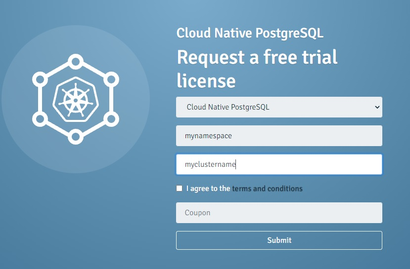

# Enterprise DB deployment example for supporting Service Director Kubernetes deployment

This is an enterprise-db version 13 Kubernetes (K8S) deployment example for supporting the Service Director Kubernetes deployment for the [Helm Chart](/kubernetes/helm). It deploys the EnterpriseDB version 13 container into a kubernetes cluster Pod.

It will create a Pod with an EnterpriseDB database prepared to install Service Director as recommended.

In order to use this example a valid EnterpriseDB user account must be used,  you can request an account from the EnterpriseDB [website](https://cloud-native.enterprisedb.com/) 

## Installation, Configuration and Deployment EDB

This section will demonstrate the following:

- Installing the Cloud Native PostgreSQL Operator
- Deploying an EDB cluster

### Step 1A.  Installation of the EDB operator on Vanilla Kubernetes

A Kubernetes operator is a method of packaging, deploying, and managing a Kubernetes application. It is an application-specific controller that extends the functionality of the Kubernetes API to create, configure, and manage instances of complex applications on behalf of a Kubernetes users. The EDB operator performs all of the database lifecycle tasks previously handled by an operational DBA.

The operator can be installed like any other resource in Kubernetes, through a YAML manifest applied via kubectl.

    kubectl apply -f https://get.enterprisedb.io/cnp/postgresql-operator-1.9.1.yaml
      
Check previously for the latest version [here]( https://get.enterprisedb.io/cnp//)  

To verify that it was successfully installed:

    kubectl get deploy -n postgresql-operator-system postgresql-operator-controller-manager
    kubectl get deploy -n postgresql-operator-system postgresql-operator-controller-manager 
    kubectl get deploy -n postgresql-operator-system postgresql-operator-controller-manager

The output must be similar to this:


```
NAME                                     READY   UP-TO-DATE   AVAILABLE   AGE
postgresql-operator-controller-manager   1/1     1            1           33s
```

### Step 1B.  Installation of the EDB operator on Openshift

#### Via the web interface
Log in to the console as kubeadmin and navigate to the Operator → OperatorHub page.

Find the Cloud Native PostgreSQL box scrolling or using the search filter.

Select the operator and click Install. Click Install again in the following Install Operator, using the default settings. For an in-depth explanation of those settings, see the Openshift documentation.

The operator will soon be available in all the namespaces.

Depending on the security levels applied to the OpenShift cluster you may be required to create a proper set of roles and permissions for the operator to be used in different namespaces. For more information on this matter see the Openshift documentation.
 

#### Via the oc command line
You can add the subscription to install the operator in all the namespaces as follows:

    oc apply -f  https://docs.enterprisedb.io/cloud-native-postgresql/latest/samples/subscription.yaml

The operator will soon be available in all the namespaces.

More information on [how to install operators](https://docs.openshift.com/container-platform/4.6/operators/admin/olm-adding-operators-to-cluster.html#olm-installing-operator-from-operatorhub-using-cli_olm-adding-operators-to-a-cluster/)           via CLI is available in the Openshift documentation.


## Step 2. EDB cluster configuration

To deploy a EDB cluster you need to apply a [configuration](./cluster.yaml) file that defines your desired Cluster.

The following file sample file defines a simple Cluster using the default storage class to allocate disk space:


```
apiVersion: postgresql.k8s.enterprisedb.io/v1
kind: Cluster
metadata:
  name: myname
  namespace: mynamespace
spec:
  instances: 1
  imageName: quay.io/enterprisedb/edb-postgres-advanced:13
  licenseKey: mylicense
  storage:
    size: 1G
```

A license key is always required for the EDB operator to work but a cluster can also be started with a trial license - which automatically expires after 30 days.

If you don't have already an EDB license you can request a free trial license here:

    https://cloud-native.enterprisedb.com/trial/

You need to specify  your namespace and name for the Cluster 

  

The [cluster](./cluster.yaml)  sample file defines a simple Cluster using the default storage class to allocate disk space.

## Step 3. Deploy an EDB cluster

In order to create the 1-node PostgreSQL cluster, you need to run the following command:

     kubectl apply -f cluster.yaml
     
     
You can check that the pods are being created with the get pods command:

     kubectl get pods
     
You can find some extra examples with more complex scenarios for the EDB deployment here:

			https://www.enterprisedb.com/docs/kubernetes/cloud_native_postgresql/samples/


EnterpriseDB requires a volume in order to store the database files, therefore a StorageClass must been added to the Cluster file. The storage size can also be increased to adjust the storage data to your requirements, the following is an example of use:


```
  storage:
    storageClass: standard
    size: 1Gi
```

**NOTES**:
- **Memory usage**: A guidance in the amount of Memory and Disk for the EnterpriseDB database K8S deployment is that it requires 2GB RAM and minimum 512M free Disk space on the assigned K8S Node. The amount of Memory of course depends of other applications/pods running in same node. In case K8S master and worker-node are in same host, like Minikube, then minimum 5GB RAM is required.

- **For production environments:**
  - You should either use an external, non-containerized database or create an image of your own.
  - Take note that this is a DB standalone example and its ports are exposed through a NodePort, but this has to be avoided in a production environment to strenghten security. And, in most of the cases, there is no need to expose DB ports. If necessary, consider using other alternatives (like using a LoadBalancer) instead.

These are the parameters to configure EDB resources in your Cluster object:
  
```
   postgresql:
    parameters:
      shared_buffers: 256MB

  resources:
    requests:
      memory: "512Mi"
      cpu: "1"
    limits:
      memory: "5Gi"
      cpu: "6"  
```
 [Shared_buffers](https://www.enterprisedb.com/edb-docs/d/postgresql/reference/manual/9.5.16/runtime-config-resource.htmll) sets the amount of memory the database server uses for shared memory buffers. The default is typically 128 megabytes (128MB)
 
 

**IMPORTANT**: Before deploying EDB a namespace  must be created. In order to generate a namespace you can use kubectl:

    kubectl create namespace mynamespace

**IMPORTANT**: EDB needs to store its data on persistent storage, therefore a persistent volume must be available.

The operator creates a persistent volume claim (PVC) for each PostgreSQL instance, with the goal to store the PGDATA, and then mounts it into each Pod.

Using the Cluster object  minimal configuration, the generated PVCs will be satisfied by the default storage class. If the target Kubernetes cluster has no default storage class, or even if you need your PVCs to be satisfied by a known storage class, you can set it into the custom resource:

```
  storage:
    storageClass: standard
    size: 1Gi
```

A persistent volume (PV) is a cluster resource that you can use to store data for a pod and it persists beyond the lifetime of that pod. The PV is backed by networked storage system such as  NFS. You can find more info [here](../../docs/PersistentVolumes.md) on how to setup your cluster for automatic creation of PV.

If you want to use PVCs in the Cluster Object you need to generate previously some persistent volumes in Kubernetes. Some Kubernetes distributions as Minikube or MicroK8S run in a single node and supports PV of type hostPath out-of-the-box. These PersistentVolumes are mapped to a directory inside the running Kubernetes instance and the provisioning is managed automatically, therefore the PV will be already generated and the EDB pods will use the default StorageClass in minikube.

To add to the Cluster the generated PVCs, you can provide a PVC template inside the Custom Resource, like in the following example:

```
  storage:
    pvcTemplate:
      accessModes:
        - ReadWriteOnce
      resources:
        requests:
          storage: 1Gi
      storageClassName: standard
      volumeMode: Filesystem
```
      
## Step 4. Configure EDB in SD Helm chart

EDB Cluster object must be configured with some parameters in order to be used with SD helm chart. They are included in the "bootstrap" tag:

```
apiVersion: postgresql.k8s.enterprisedb.io/v1
kind: Cluster
metadata:
  name: cluster-example-full
  namespace: mynamespace
spec:
  bootstrap:
    initdb:
      database: sa
      owner: sa
      secret:
        name: cluster-app-user
```
The bootstrap part must be added to your Cluster object before deployment. It includes a reference to a "Secret" object "cluster-app-user" containing the DB credentials. 
Therefore the following Secret object must be deployed before the Cluster object is deployed:

```
apiVersion: v1
kind: Secret
metadata:
  name: cluster-app-user
  namespace: mynamespace
type: kubernetes.io/basic-auth
data:
  password: c2VjcmV0
  username: c2E=

```

Before deploying the SD Helm chart you need to add some parameters to point to the EDB database pod, this can be achieved by modifying some parameters in the values.yaml file:

```
sdimage:
  env:
    SDCONF_activator_db_hostname: myEDB-service-name
    SDCONF_activator_db_port: 5432
    SDCONF_activator_db_user: sa
    SDCONF_activator_db_vendor: EnterpriseDB
```

where "myEDB-service-name" is the service created during the deployment of the EDB pod. You could look for it with `kubectl get services -n mynamespace`, in our example it would be: `cluster-example-full-any`.


